# Re-factoring AWS cloud provisioning of our Dynamic Web Application

In this section we will cover the re-factoring (re-architecting) activities, in order to move our Dynamic Web Application from the local Vagrant environment ...:

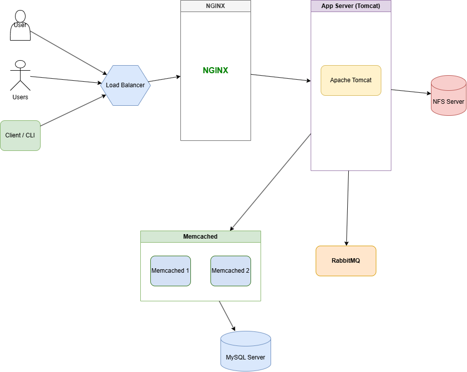

... to the AWS cloud environment:

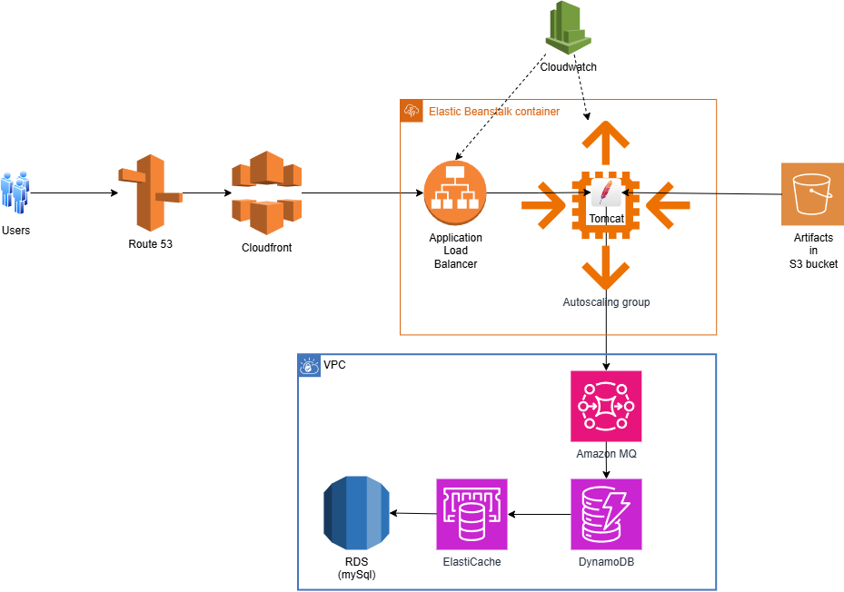

Our objective is:

* to have a flexible and scalable archecture.

* without an upfront investment in hardware and software: it will be a pay-as-you-go model, which means that we will only pay for the resources that we use.

* To be provisioned as IAAC, PAAS and SAAS, which will allow us to automate the provisioning of the infrastructure, platform and software services, and to manage them as code.

* to be provisioned as CI/CD, which will allow us to automate the build, test and deployment of our application, and to manage them as code.

That will achieve low operational overhead, high availability, and high scalability of our application, which will allow us to focus on the development of our application, and not on the management of the infrastructure.

# Services that we will be using in AWS cloud environment in order to deploy our Dynamic Web Application

## Front-end services

* Beanstalk: for Tomcat and Nginx services, which will allow us to deploy and manage our web application easily. It will automatically handle the deployment, capacity provisioning, load balancing, and auto-scaling of our application.

* S3/EFS: for storing static content, which will allow us to store and retrieve our static files easily. S3 is a highly scalable object storage service that can store and retrieve any amount of data from anywhere on the web. EFS is a fully managed file storage service that can be used to store and share files across multiple instances.

## Back-end services

* RDS: A managed relational database service that makes it easy to set up, operate, backup, and scale a relational database in the cloud. It supports multiple database engines, including MySQL, PostgreSQL, Oracle, and SQL Server.

* Elasticache: A fully managed in-memory data store service that supports Redis and Memcached. It can be used to improve the performance of our application by caching frequently accessed data. It will take care of the memcached service, which will allow us to store and retrieve data quickly. It will automatically handle the scaling, patching, and backup of our cache.

* ActiveMQ: A managed message broker service that supports multiple messaging protocols, including AMQP, MQTT, and STOMP. It can be used to decouple our application components and improve the scalability and reliability of our application. It will take care of the RabbitMQ service, which will allow us to send and receive messages between our application components. It will automatically handle the scaling, patching, and backup of our message broker.

* Route53: A scalable and highly available domain name system (DNS) web service that translates domain names into IP addresses. It allows us to route traffic to our application resources, such as EC2 instances, S3 buckets, and load balancers.

* Cloudfront: A content delivery network (CDN) that securely delivers data, videos, applications, and APIs to customers globally with low latency and high transfer speeds. It uses a network of edge locations to cache content closer to the end-users, improving the performance and availability of our application.

# Hands on manual provisioning of our Dynamic Web Application in AWS cloud environment

As a rule of thumb, before the automated provisioning always do the manual provisioning first, in order to understand the underlying processes and configurations involved in setting up the environment.

## Create security group for ElasticAche, RDS and ActiveMQ
The security group will be created with the following configuration:
* Inbound rules:
  * Allow traffic from the Beanstalk security group on the required ports (e.g. 3306 for MySQL, 11211 for Memcached, 5672 for RabbitMQ)

```bash
user@DESKTOP-SCNMK3I UCRT64 ~/Documents/devops-exercise-from-local-to-cloud/aws (main)
Wed Oct 07 07:47:37
$ AWS_REGION="${AWS_REGION:-us-east-1}"

user@DESKTOP-SCNMK3I UCRT64 ~/Documents/devops-exercise-from-local-to-cloud/aws (main)
Wed Oct 07 07:51:09
$ echo $AWS_REGION
us-east-1

user@DESKTOP-SCNMK3I UCRT64 ~/Documents/devops-exercise-from-local-to-cloud/aws (main)
Wed Oct 07 07:51:16
$ SG_NAME="vprofile-backend-sg"
SG_DESC="${DESCRIPTION:-Security group for the backend services of the vprofile project}"

user@DESKTOP-SCNMK3I UCRT64 ~/Documents/devops-exercise-from-local-to-cloud/aws (main)
Wed Oct 07 07:51:31
$ SG_ID=$(aws ec2 create-security-group \
    --region "$AWS_REGION" \
    --group-name "$SG_NAME" \
    --description "$SG_DESC" \
    --query "GroupId" \
    --output text)
```

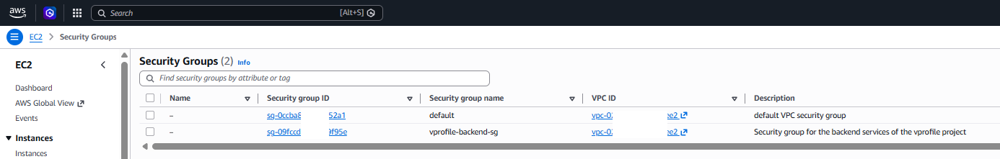

Make the traffic to this security group only accessible from instances in the security group itself, so all the backend services can communicate with each other using their private IP addresses, but they will not be accessible from the internet:

```bash
user@DESKTOP-SCNMK3I UCRT64 ~/Documents/devops-exercise-from-local-to-cloud/aws (main)
Wed Oct 07 07:52:01
$ $ aws ec2 authorize-security-group-ingress \
    --group-id "$SG_ID" \
    --protocol -1 \
    --port -1 \
    --source-group "$SG_ID"
{
    "Return": true,
    "SecurityGroupRules": [
        {
            "SecurityGroupRuleId": "sgr-0743c******b0bd",
            "GroupId": "sg-09fc********f95e",
            "GroupOwnerId": "430300*****905",
            "IsEgress": false,
            "IpProtocol": "-1",
            "FromPort": -1,
            "ToPort": -1,
            "ReferencedGroupInfo": {
                "GroupId": "sg-09fc********f95e",
                "UserId": "430300*****905"
            },
            "SecurityGroupRuleArn": "arn:aws:ec2:us-east-1:430300*****905:security-group-rule/sgr-0743c******b0bd"
        }
    ]
}
```

The security group inbound rules will look like this:

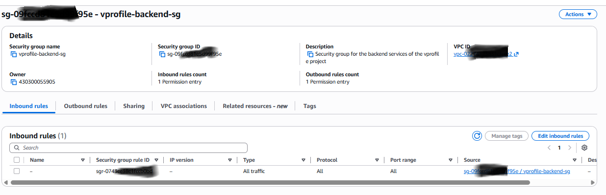

**Note:** Later we will create Beanstalk security group, and we will allow traffic from the Beanstalk security group to the backend security group on the required ports (e.g. 3306 for MySQL, 11211 for Memcached, 5672 for RabbitMQ).

## Create RDS instance

The RDS instance will be created with the following configuration:
* MySQL 8.0 running on Amazon Linux 2

First, we will create a parameter group for the RDS instance, which will allow us to configure the MySQL parameters according to our application requirements.

```bash
user@DESKTOP-SCNMK3I UCRT64 ~/Documents/devops-exercise-from-local-to-cloud/aws (main)
Wed Oct 07 08:26:27
$ RDS_PG_ARN=$(aws rds create-db-parameter-group \
    --db-parameter-group-name "$DB_PG_NAME" \
    --db-parameter-group-family "$DB_FAMILY" \
    --description="$DB_PG_DESC" \
    --region "$AWS_REGION" \
    --query "DBParameterGroup.DBParameterGroupArn" \
    --output text)
```

This is how the parameter group will look like in the AWS console:

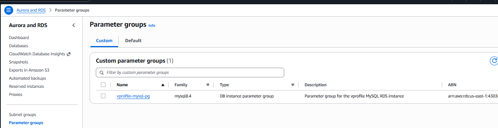

Create a subnet group for the RDS instance, which will allow us to deploy the RDS instance in a VPC with multiple availability zones for high availability and fault tolerance.

```bash
user@DESKTOP-SCNMK3I UCRT64 ~/Documents/devops-exercise-from-local-to-cloud/aws (main)
Wed Oct 07 10:18:42
$ SUBNET_IDS=($(aws ec2 describe-subnets \
    --region "$AWS_REGION" \
    --query "Subnets[*].SubnetId" \
    --output text))
    
echo "${SUBNET_IDS[@]}"

user@DESKTOP-SCNMK3I UCRT64 ~/Documents/devops-exercise-from-local-to-cloud/aws (main)
Wed Oct 07 10:18:48
$ RDS_SG_NAME=$(aws rds create-db-subnet-group \
    --db-subnet-group-name "$SG_NAME" \
    --db-subnet-group-description "$SG_DESC" \
    --subnet-ids ${SUBNET_IDS[@]} \
    --region "$AWS_REGION" \
    --query "DBSubnetGroup.DBSubnetGroupName" \
    --output text)
   
echo "RDS_SG_NAME: $RDS_SG_NAME"
```

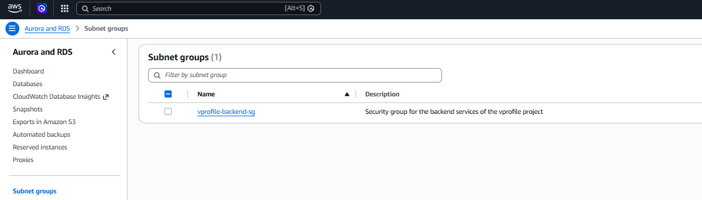

Now we will create the RDS instance with the following configuration:

```bash
user@DESKTOP-SCNMK3I UCRT64 ~/Documents/devops-exercise-from-local-to-cloud/aws (main)
Wed Oct 07 10:54:51
$ DB_INSTANCE_NAME="vprofiledb"
DB_INSTANCE_CLASS="db.t3.micro"
DB_ENGINE="mysql"
DB_USERNAME="admin"
DB_PASSWORD="**********"
DB_NAME="vprofilerdsrearch"

user@DESKTOP-SCNMK3I UCRT64 ~/Documents/devops-exercise-from-local-to-cloud/aws (main)
Wed Oct 07 10:54:53
$ aws rds create-db-instance \
    --db-instance-identifier "$DB_INSTANCE_NAME" \
    --db-instance-class db.t3.micro \
    --engine mysql \
    --engine-version 8.4.11 \
    --master-username "$DB_USERNAME" \
    --master-user-password "$DB_PASSWORD" \
    --allocated-storage 20 \
    --storage-type gp2 \
    --db-name "$DB_NAME" \
    --db-parameter-group-name "$DB_PG_NAME" \
    --db-subnet-group-name "$RDS_SG_NAME" \
    --vpc-security-group-ids "$SG_ID" \
    --backup-retention-period 0 \
    --no-multi-az \
    --no-publicly-accessible \
    --no-storage-encrypted \
    --no-auto-minor-version-upgrade \
    --region "$AWS_REGION" \
    --query "DBInstance.DBInstanceArn" \
    --output text
arn:aws:rds:us-east-1:43030********:db:vprofiledb
```

After a few minutes, the RDS instance will be available:

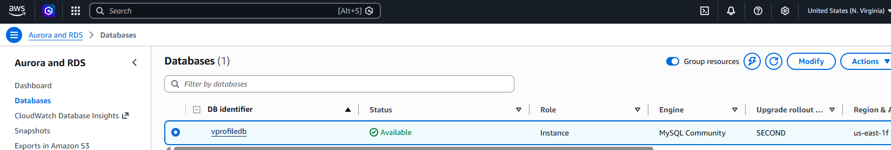

**Please note** that we will not be able to connect to it using the endpoint because we explicitly didn't allow during the backend security group creation:

```bash
user@DESKTOP-SCNMK3I UCRT64 ~/Documents/devops-exercise-from-local-to-cloud/aws (main)
Wed Oct 07 11:16:00
$ curl -o global-bundle.pem https://truststore.pki.rds.amazonaws.com/global/global-bundle.pem
  % Total    % Received % Xferd  Average Speed  Time    Time    Time   Current
                                 Dload  Upload  Total   Spent   Left   Speed
100 166.0k 100 166.0k   0      0 407.9k      0                              0

user@DESKTOP-SCNMK3I UCRT64 ~/Documents/devops-exercise-from-local-to-cloud/aws (main)
Wed Oct 07 11:16:06
$ mysql -h vprofiledb.cg**********8tsa.us-east-1.rds.amazonaws.com -P 3306 -u admin -p --ssl-mode=VERIFY_IDENTITY --ssl-ca=./global-bundle.pem
Enter password: ***********
ERROR 2003 (HY000): Can't connect to MySQL server on 'vprofiledb.cg**********8tsa.us-east-1.rds.amazonaws.com:3306' (10060)
```

Temporarily, we will modify the RDS instance to be publicly accessible, so we can connect to it using the endpoint:

```bash
user@DESKTOP-SCNMK3I UCRT64 ~/Documents/devops-exercise-from-local-to-cloud (main)
Wed Oct 07 14:41:23
$ aws rds modify-db-instance \
    --db-instance-identifier "$DB_INSTANCE_NAME" \
    --publicly-accessible \
    --apply-immediately \
    --region "$AWS_REGION"
{
    "DBInstance": {
        "DBInstanceIdentifier": "vprofiledb",
        "DBInstanceClass": "db.t3.micro",
        "Engine": "mysql",
        "DBInstanceStatus": "available",
        "MasterUsername": "admin",
        "DBName": "vprofilerdsrearch",
        "Endpoint": {
...
```

Wait for the instance to be available:

```bash
user@DESKTOP-SCNMK3I UCRT64 ~/Documents/devops-exercise-from-local-to-cloud (main)
Wed Oct 07 14:43:15
$ aws rds wait db-instance-available     --db-instance-identifier "$DB_INSTANCE_NAME"     --region "$AWS_REGION"
```

We will also add our IP to the Correct Security Group

```bash
user@DESKTOP-SCNMK3I UCRT64 ~/Documents/devops-exercise-from-local-to-cloud (main)
Wed Oct 07 15:01:08
$ aws ec2 authorize-security-group-ingress \
    --group-id "sg-09f************95e" \
    --protocol tcp \
    --port 3306 \
    --cidr $(curl -s ifconfig.me)/32 \
    --region us-east-1
{
    "Return": true,
    "SecurityGroupRules": [
        {
            "SecurityGroupRuleId": "sgr-071************4c6",
            "GroupId": "sg-09f************95e",
            "GroupOwnerId": "4************5",
            "IsEgress": false,
            "IpProtocol": "tcp",
            "FromPort": 3306,
            "ToPort": 3306,
            "CidrIpv4": "*89.*6*.2**.132/32",
            "SecurityGroupRuleArn": "arn:aws:ec2:us-east-1:4************5:security-group-rule/sgr-071************4c6"
        }
    ]
}
```

Get the pem file:

```bash
curl -o global-bundle.pem https://truststore.pki.rds.amazonaws.com/global/global-bundle.pem
```

And run the sql script:

```bash
user@DESKTOP-SCNMK3I UCRT64 ~/Documents/devops-exercise-from-local-to-cloud (main)
Wed Oct 07 15:08:00
$ mysql -h vprofiledb.cg********sa.us-east-1.rds.amazonaws.com \
    -P 3306 -u admin -p \
    --ssl-mode=VERIFY_IDENTITY \
    --ssl-ca=./global-bundle.pem < aws/db_backup.sql
Enter password: ***********
```

The script has been executed successfully, we can now make the RDS instance NON publicly accessible:

```bash
user@DESKTOP-SCNMK3I UCRT64 ~/Documents/devops-exercise-from-local-to-cloud (main)
Wed Oct 07 15:16:37
$ aws rds modify-db-instance \
    --db-instance-identifier "$DB_INSTANCE_NAME" \
    --no-publicly-accessible \
    --apply-immediately \
    --region "$AWS_REGION"
{
    "DBInstance": {
        "DBInstanceIdentifier": "vprofiledb",
        "DBInstanceClass": "db.t3.micro",
        "Engine": "mysql",
        "DBInstanceStatus": "available",
        "MasterUsername": "admin",
        "DBName": "vprofilerdsrearch",
        "Endpoint": {
            "Address": "vprofiledb.cg********sa.us-east-1.rds.amazonaws.com",
            "Port": 3306,
            "HostedZoneId": "Z2R2ITUGPM61AM"
        },
...
```

Wait for the instance to be available:

```bash
user@DESKTOP-SCNMK3I UCRT64 ~/Documents/devops-exercise-from-local-to-cloud (main)
Wed Oct 07 14:43:15
$ aws rds wait db-instance-available     --db-instance-identifier "$DB_INSTANCE_NAME"     --region "$AWS_REGION"
```

We will also revoke our IP from the Security Group

```bash
user@DESKTOP-SCNMK3I UCRT64 ~/Documents/devops-exercise-from-local-to-cloud (main)
Wed Oct 07 15:19:08
$ aws ec2 revoke-security-group-ingress \
    --group-id $SG_ID \
    --protocol tcp \
    --port 3306 \
    --cidr $(curl -s ifconfig.me)/32 \
    --region $AWS_REGION
{
    "Return": true,
    "RevokedSecurityGroupRules": [
        {
            "SecurityGroupRuleId": "sgr-071************4c6",
            "GroupId": "sg-09f************95e",
            "IsEgress": false,
            "IpProtocol": "tcp",
            "FromPort": 3306,
            "ToPort": 3306,
            "CidrIpv4": "*89.*6*.2**.132/32"
        }
    ]
}
```

## Create Elasticache instance

Next, we will create a single-node, non-HA ElastiCache for Memcached cluster.

We will set up a low-capacity option with no redundancy, so you may lose cached data if replaced.

Create a subnet group using subnets from the same VPC as the backend security group. A custom parameter group is unnecessary unless you need non-default Memcached settings; omit it to use the default group.

```bash
user@DESKTOP-SCNMK3I UCRT64 ~/Documents/devops-exercise-from-local-to-cloud/aws (main)
Wed Oct 07 10:18:42
$ SUBNET_IDS=($(aws ec2 describe-subnets \
    --region "$AWS_REGION" \
    --query "Subnets[*].SubnetId" \
    --output text))
    
echo "SUBNET_IDS: ${SUBNET_IDS[@]}"

ELASTICACHE_SUBNET_GROUP="vprofile-elasticache-subnets"
ELASTICACHE_SUBNET_GROUP_DESC="Subnets for the vprofile ElastiCache cluster"

user@DESKTOP-SCNMK3I UCRT64 ~/Documents/devops-exercise-from-local-to-cloud/aws (main)
Wed Oct 07 11:17:00
$ aws elasticache create-cache-subnet-group \
    --cache-subnet-group-name "$ELASTICACHE_SUBNET_GROUP" \
    --cache-subnet-group-description "$ELASTICACHE_SUBNET_GROUP_DESC" \
    --subnet-ids "${SUBNET_IDS[@]}" \
    --region "$AWS_REGION" \
    --query "CacheSubnetGroup.CacheSubnetGroupId" \
    --output text
```

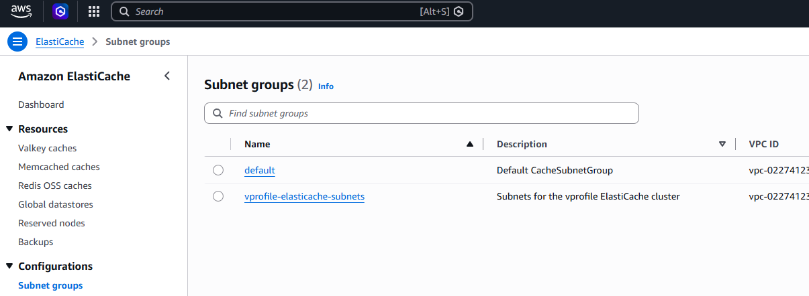

Create a parameter group using the default Memcached settings. A custom parameter group is unnecessary unless you need non-default Memcached settings; omit it to use the default group.

```bash
ELASTICACHE_PG_NAME="vprofile-elasticache-parameter-group"

user@DESKTOP-SCNMK3I UCRT64 ~/Documents/devops-exercise-from-local-to-cloud/aws (main)
Wed Oct 07 11:17:30
$ aws elasticache create-cache-parameter-group \
    --cache-parameter-group-name "$ELASTICACHE_PG_NAME" \
    --cache-parameter-group-family memcached1.6 \
    --description "Parameter group for the vprofile ElastiCache cluster" \
    --region "$AWS_REGION" \
    --query "CacheParameterGroup.CacheParameterGroupId" \
    --output text
```

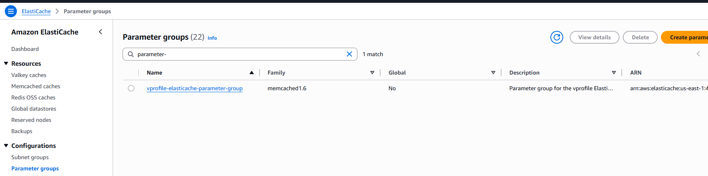


Get the latest elasticache engine version, which is required to create the cluster:

```bash
user@DESKTOP-SCNMK3I UCRT64 ~/Documents/devops-exercise-from-local-to-cloud/aws (main)
Wed Oct 07 11:17:50
$ ELASTICACHE_ENGINE_VERSION=$(aws elasticache describe-cache-engine-versions \
    --engine memcached \
    --region "$AWS_REGION" \
    --query "CacheEngineVersions[-1].EngineVersion" \
    --output text)

echo "ELASTICACHE_ENGINE_VERSION: $ELASTICACHE_ENGINE_VERSION"
```

Create the cluster:

```bash
ELASTICACHE_CLUSTER_ID="vprofile-elasticache"

aws elasticache 
user@DESKTOP-SCNMK3I UCRT64 ~/Documents/devops-exercise-from-local-to-cloud/aws (main)
Wed Oct 07 11:18:00
$ aws elasticache create-cache-cluster \
    --cache-cluster-id "$ELASTICACHE_CLUSTER_ID" \
    --cache-node-type cache.t4g.micro \
    --engine memcached \
    --engine-version "$ELASTICACHE_ENGINE_VERSION" \
    --num-cache-nodes 1 \
    --cache-parameter-group-name "$ELASTICACHE_PG_NAME" \
    --cache-subnet-group-name "$ELASTICACHE_SUBNET_GROUP" \
    --security-group-ids "$SG_ID" \
    --region "$AWS_REGION" \
    --query "CacheCluster.CacheClusterId" \
    --output text
    
vprofile-elasticache
```

The ElastiCache cluster will be available after a few minutes:

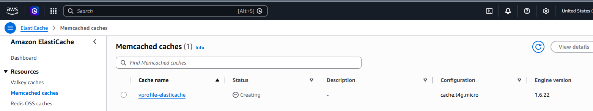

## Create AmazonMQ instance

The AmazonMQ instance will be created with the cheapest possible tier, hence we will create a single-instance broker with no redundancy, so you may lose messages if replaced.

```bash

user@DESKTOP-SCNMK3I UCRT64 ~/Documents/devops-exercise-from-local-to-cloud/aws (main)
Wed Oct 07 13:46:05
$user@DESKTOP-SCNMK3I UCRT64 ~/Documents/devops-exercise-from-local-to-cloud/aws (main)
Wed Oct 07 13:49:06
$ MQ_ENGINE_VERSION=$(aws mq describe-broker-engine-types \
    --engine-type ActiveMQ \
    --region "$AWS_REGION" \
    --query "BrokerEngineTypes[-1].EngineVersions[-1].Name" \
    --output text)

user@DESKTOP-SCNMK3I UCRT64 ~/Documents/devops-exercise-from-local-to-cloud/aws (main)
Wed Oct 07 13:50:08
$ echo "MQ_ENGINE_VERSION:  $MQ_ENGINE_VERSION"
MQ_ENGINE_VERSION:  5.18

user@DESKTOP-SCNMK3I UCRT64 ~/Documents/devops-exercise-from-local-to-cloud/aws (main)```
Wed Oct 07 13:46:20
$ AMAZONMQ_BROKER_NAME="vprofile-activemq"
MQ_USERNAME="admin"
MQ_PASSWORD="**********"

user@DESKTOP-SCNMK3I UCRT64 ~/Documents/devops-exercise-from-local-to-cloud/aws (main)
Wed Oct 07 13:46:20
Wed Oct 07 13:50:12
$ aws mq create-broker \
    --broker-name "$AMAZONMQ_BROKER_NAME" \
    --engine-type ActiveMQ \
    --engine-version "$MQ_ENGINE_VERSION" \
    --host-instance-type mq.t3.micro \
    --deployment-mode SINGLE_INSTANCE \
    --security-groups "$SG_ID" \
    --subnet-ids "${SUBNET_IDS[0]}" \
    --no-publicly-accessible \
    --users Username="$MQ_USERNAME",Password="$MQ_PASSWORD",ConsoleAccess=true \
    --region "$AWS_REGION" \
    --query "BrokerArn" \
    --output text

arn:aws:mq:us-east-1:430300*****905:broker:vprofile-activemq:1-2a3b4c5d-6e7f-8g9h-0i1j-2k3l4m5n6o
```

This is how the AmazonMQ instance will look like in the AWS console:

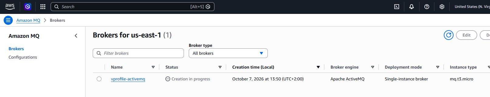

At the same time, the configuration of the AmazonMQ instance will look like this:

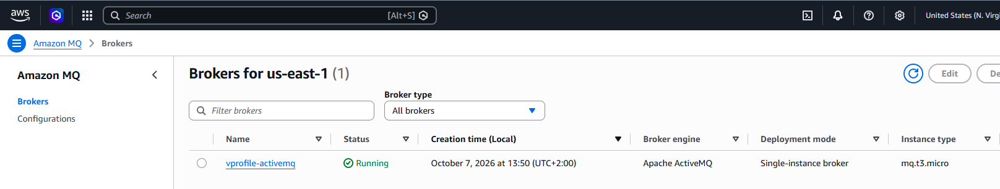

## Create Elastic Beanstalk Environment

Deploy a Tomcat web application via Elastic Beanstalk utilizing the most cost-effective architecture available (aiming for AWS Free Tier eligibility):

* **Platform**: Tomcat 9.0 running on 64bit Amazon Linux 2.
* **Proxy**: Nginx configured as a reverse proxy.
* **IAM Role**: Automatically provision and assign a dedicated service role with the principle of least privilege (minimum required permissions).
* **Cost Optimization**: Configured as a single-instance environment to ensure the lowest possible cost, fitting within standard free-tier thresholds where applicable.

First, we create the IAM Role & Instance Profile:

* Create the IAM Role (trust policy for EC2)

```bash
aws iam create-role \
    --role-name vprofile-eb-ec2-role \
    --assume-role-policy-document '{
      "Version": "2012-10-17",
      "Statement": [{
        "Effect": "Allow",
        "Principal": { "Service": "ec2.amazonaws.com" },
        "Action": "sts:AssumeRole"
      }]
    }' \
    --region us-east-1
```

Run in CloudShell
1b. Attach Minimum Required Managed Policy (Web Tier only)
aws iam attach-role-policy \
--role-name vprofile-eb-ec2-role \
--policy-arn arn:aws:iam::aws:policy/AWSElasticBeanstalkWebTier

Run in CloudShell
This policy grants only what's needed: read app versions from S3, write logs to S3, and report health to Elastic Beanstalk.

1c. Create the Instance Profile and attach the Role
aws iam create-instance-profile \
--instance-profile-name vprofile-eb-instance-profile

aws iam add-role-to-instance-profile \
--instance-profile-name vprofile-eb-instance-profile \
--role-name vprofile-eb-ec2-role

Run in CloudShell
Step 2 — Create the Elastic Beanstalk Application
aws elasticbeanstalk create-application \
--application-name vprofile-web-app \
--description "Vprofile Tomcat Web Application" \
--region us-east-1

Run in CloudShell
Step 3 — Create the Environment (Free Tier — Single Instance, t3.micro)
aws elasticbeanstalk create-environment \
--application-name vprofile-web-app \
--environment-name vprofile-web-env \
--solution-stack-name "64bit Amazon Linux 2023 v5.14.9 running Tomcat 10 Corretto 17" \
--option-settings \
Namespace=aws:autoscaling:launchconfiguration,OptionName=IamInstanceProfile,Value=vprofile-eb-instance-profile \
Namespace=aws:autoscaling:launchconfiguration,OptionName=InstanceType,Value=t3.micro \
Namespace=aws:elasticbeanstalk:environment,OptionName=EnvironmentType,Value=SingleInstance \
--region us-east-1

Run in CloudShell
Wait for it to be ready
aws elasticbeanstalk wait environment-updated \
--application-name vprofile-web-app \
--environment-names vprofile-web-env \
--region us-east-1

Run in CloudShell
Step 4 — Get Your Application URL
aws elasticbeanstalk describe-environments \
--application-name vprofile-web-app \
--environment-names vprofile-web-env \
--query "Environments[0].CNAME" \
--output text \
--region us-east-1


## Update SG of backend to allow access from Beanstalk SG

The backend services (RDS, Elasticache and ActiveMQ) are in the same VPC, so they can communicate with each other using their private IP addresses. However, the Beanstalk environment is in a different VPC, so we need to allow access from the Beanstalk SG to the backend SG.

## Update backend SG to allow internal traffic

The backend services (RDS, Elasticache and ActiveMQ) are in the same VPC, so they can communicate with each other using their private IP addresses. However, the Beanstalk environment is in a different VPC, so we need to allow access from the Beanstalk SG to the backend SG.

## Launch ec2-instance for DB initialization
The ec2-instance will be launched with the following configuration:
* Amazon Linux 2

## Login to the ec2-instance and initialize the RDS database with the following commands:
```bash
mysql -h <RDS-endpoint> -u <username> -p <password>
CREATE DATABASE <database-name>;
USE <database-name>;
CREATE TABLE <table-name> (
    id INT AUTO_INCREMENT PRIMARY KEY,
    name VARCHAR(255) NOT NULL,
    email VARCHAR(255) NOT NULL,
    created_at TIMESTAMP DEFAULT CURRENT_TIMESTAMP
);
```

## Change the health check of the Beanstalk container to /login

## Add 443 https listener to the ALB of the Beanstalk container

## Build artifact from source code with backend information

## Deploy artifact to the Beanstalk container

## Create Content Delivery Network (CDN) with ssl certificate for the Beanstalk container

## Optional, update entry in GoDaddy DNS zones, or do it in Route53, to point to the CDN distribution

## Test the application by accessing the CDN URL in a web browser, and verify that the application is working as expected.


