- [1. Setup AWS client application access](#1-setup-aws-client-application-access)
   - [1.1. Automation scripts](#11-automation-scripts)
- [2. Deploy a Web Application on AWS using the provided scripts](#2-deploy-a-web-application-on-aws-using-the-provided-scripts)
   - [2.1. Spin up the first EC2 web server instance](#21-spin-up-the-first-ec2-web-server-instance)
   - [2.2. Make sure that the EFS has been correctly attacched to the EC2 instance](#22-make-sure-that-the-efs-has-been-correctly-attacched-to-the-ec2-instance)
   - [2.3. Spin another EC2 instance with different name](#23-spin-another-ec2-instance-with-different-name)
   - [2.4. Cleanup the lab](#24-cleanup-the-lab)
- [3. Add an autoscaling group to the spinup mix](#3-add-an-autoscaling-group-to-the-spinup-mix)
- [4. Optional, add a load balancer to the spinup mix](#4-optional-add-a-load-balancer-to-the-spinup-mix)
   - [4.1. Clean up the lab](#41-clean-up-the-lab)


# 1. Setup AWS client application access

Install aws cli

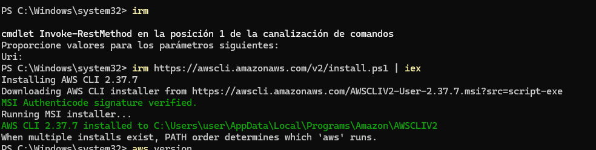

Update aws cli

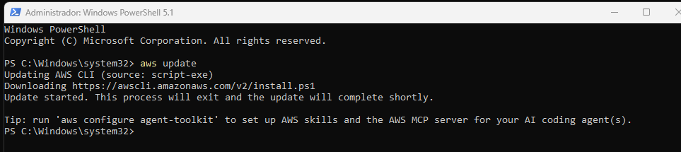

Install AGENT-TOOLKIT, first you need to install one of the agent clients from the list:

```powershell
PS C:\Windows\system32> [Environment]::SetEnvironmentVariable("Path", $env:Path + ";C:\Users\user\.local\bin", "User")
```

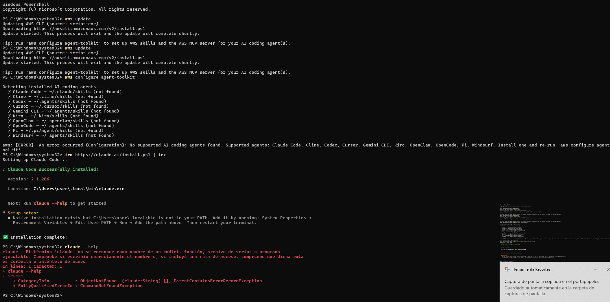

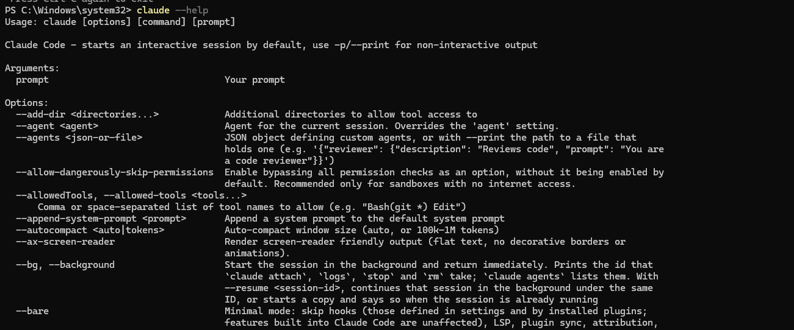

Open new Powershell and configure claude cli:

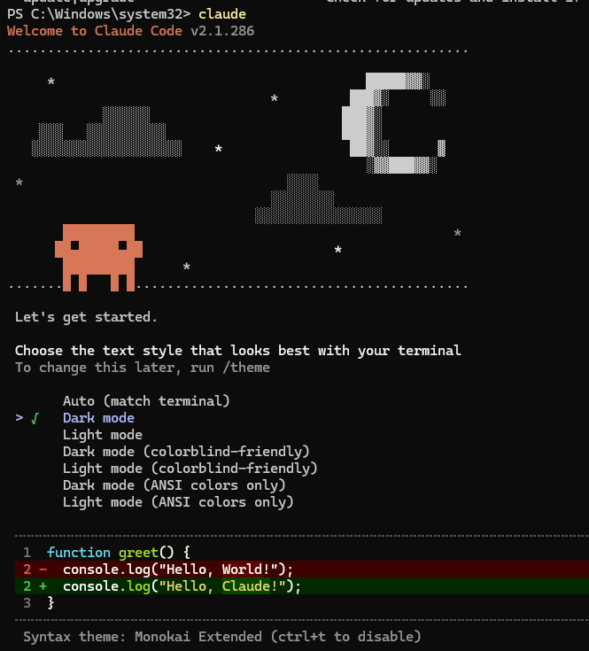

There is not a free tier option for claude cli,

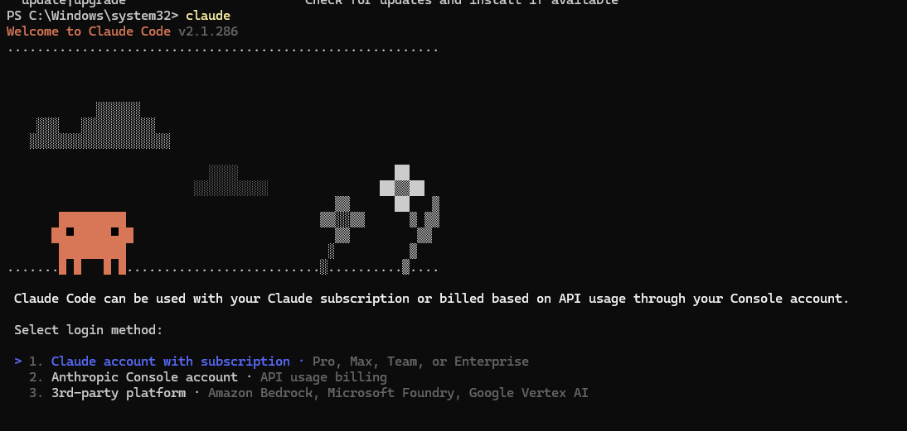

I will use Gemini cli instead.

I've changed my mind and will use Gemini cli because claude is not free tier:

• Install node.js https://nodejs.org/es/download

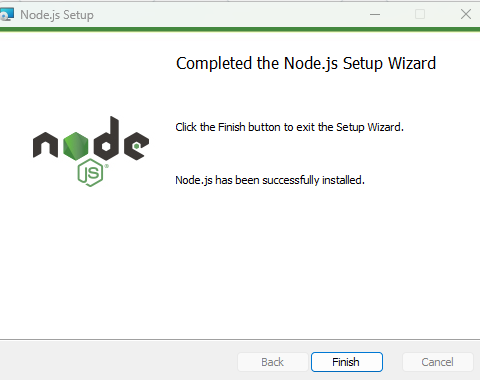

• Install gemini cli

```powershell
npm install -g @google/gemini-cli
```

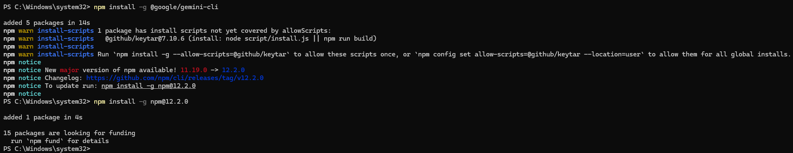

Executing gemini cli from a safe folder:

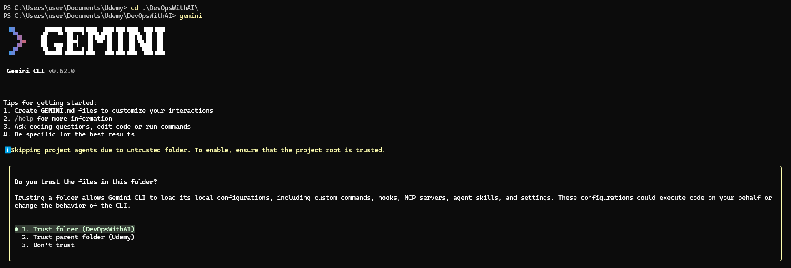

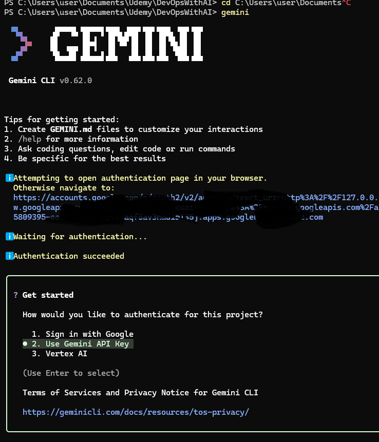

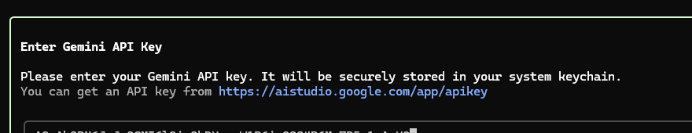

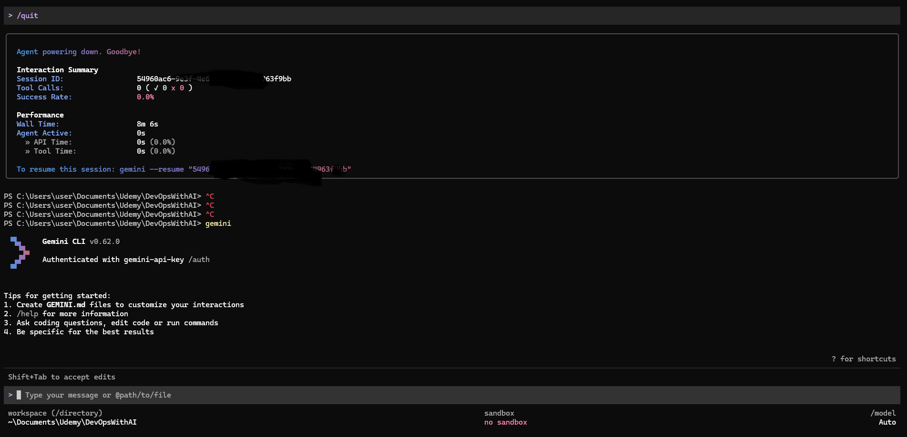

Now we can install AGENT-TOOLKIT from this window:

```powershell
aws configure agent-toolkit
```
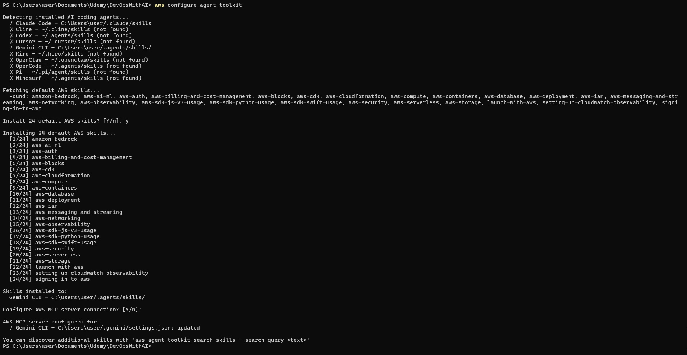

And then log in from command line:

```powershell
aws login
```

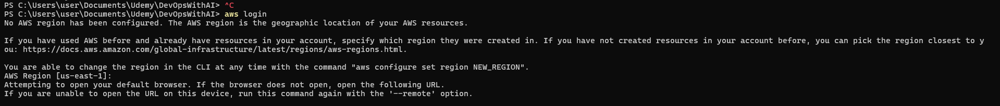

## 1.1. Automation scripts

I don’t want to incurr in extra costs or leaving garbage, so I have created a few scripts that we will using during the next sections of this lab. These scripts will help us to check the cost of our AWS account, check for unused resources, and clean up the lab:


### a) [aws_cost_explorer.sh](scripts/aws_cost_explorer.sh)

### b) [aws_unused_resources.sh](scripts/aws_unused_resources.sh)

### c) [aws_lab_cleanup.sh](scripts/aws_lab_cleanup.sh)

### d) [aws_spinup_ec2_website.sh](scripts/aws_spinup_ec2_website.sh)

### e) [aws_lab_manager.sh](scripts/aws_lab_manager.sh)

### f) [aws_lab_manager_with_autoscaling_group.sh](scripts/aws_lab_manager_with_autoscaling_group.sh)

# 2. Deploy a Web Application on AWS using the provided scripts

This application will be deployed on a 2 EC2 instances that will share the same EFS (Elastic File System) for the /var/www/html folder. The application will be a simple web page with some images and text, and will be accessed via an Autoscaling Group and a Load Balancer. The application will be deployed using the scripts provided in this lab.

### 2.1. Spin up the first EC2 web server instance

```bash
$ ./aws_lab_manager.sh spinup
Enter a choice for the EC2 Instance Name (default: Web-Server-Instance):
=============================================================
 CONFIGURATION PARAMETERS (SPINUP):
 Region:            us-east-1
 Security Group:    web-app-sg
 EFS Name:          Custom-Web-EFS
 Instance Type:     t3.micro
 Instance Name:     Web-Server-Instance
 Custom AMI ID:     [Amazon Linux 2023 por defecto]
=============================================================
Do you want to start the deployment (spinup) with these parameters? (y/n): y
[INFO][aws_lab_manager.sh]      Starting deployment in region: us-east-1
[INFO][aws_lab_manager.sh]      === 1. Verifying IAM Role and Instance Profile ===
[INFO][aws_lab_manager.sh]      IAM role already exists. Ensuring EFS client policy is attached...
[INFO][aws_lab_manager.sh]      Instance profile already exists.
[INFO][aws_lab_manager.sh]      === 2. Resolving AMI ID ===
[INFO][aws_lab_manager.sh]      No custom AMI provided. Fetching latest Amazon Linux 2023 AMI...
[OK][aws_lab_manager.sh]        Selected AMI: ami-0d***0fb3bac***24
[INFO][aws_lab_manager.sh]      === 3. Creating EC2 Security Group ===
[OK][aws_lab_manager.sh]        Security group created with ID: sg-0***f3d80b***59e7
[INFO][aws_lab_manager.sh]      === 4. Configuring Ingress Rules (HTTP & SSH) ===
{
    "Return": true,
    "SecurityGroupRules": [
        {
            "SecurityGroupRuleId": "sgr-01b***570dd***010",
            "GroupId": "sg-0***f3d80b***59e7",
            "GroupOwnerId": "430***0559**",
            "IsEgress": false,
            "IpProtocol": "tcp",
            "FromPort": 80,
            "ToPort": 80,
            "CidrIpv4": "0.0.0.0/0",
            "SecurityGroupRuleArn": "arn:aws:ec2:us-east-1:430***0559**:security-group-rule/sgr-01b***570dd***010"
        }
    ]
}

{
    "Return": true,
    "SecurityGroupRules": [
        {
            "SecurityGroupRuleId": "sgr-04b****66f04***de3",
            "GroupId": "sg-0***f3d80b***59e7",
            "GroupOwnerId": "430***0559**",
            "IsEgress": false,
            "IpProtocol": "tcp",
            "FromPort": 22,
            "ToPort": 22,
            "CidrIpv4": "89.6.240.132/32",
            "SecurityGroupRuleArn": "arn:aws:ec2:us-east-1:430***0559**:security-group-rule/sgr-04b****66f04***de3"
        }
    ]
}

[INFO][aws_lab_manager.sh]      === 4.1. Configuring Amazon EFS (Decoupled Security Group & Mount Targets) ===
{
    "Return": true,
    "SecurityGroupRules": [
        {
            "SecurityGroupRuleId": "sgr-06c***e1a8b***39b",
            "GroupId": "sg-0d***791a4d***268",
            "GroupOwnerId": "430***0559**",
            "IsEgress": false,
            "IpProtocol": "tcp",
            "FromPort": 2049,
            "ToPort": 2049,
            "CidrIpv4": "172.31.0.0/16",
            "SecurityGroupRuleArn": "arn:aws:ec2:us-east-1:430***0559**:security-group-rule/sgr-06c***e1a8b***39b"
        }
    ]
}

[INFO][aws_lab_manager.sh]      Creating mount target for subnet subnet-084***5e****c8252...
[INFO][aws_lab_manager.sh]      Creating mount target for subnet subnet-05***3c4f0e***0f9...
[INFO][aws_lab_manager.sh]      Creating mount target for subnet subnet-0***0044eb2***307...
[INFO][aws_lab_manager.sh]      Creating mount target for subnet subnet-0be***75eb7***99b...
[INFO][aws_lab_manager.sh]      Creating mount target for subnet subnet-019***2751***7a69...
[INFO][aws_lab_manager.sh]      Creating mount target for subnet subnet-02af***e684a***d7...
[INFO][aws_lab_manager.sh]      Waiting for all EFS mount targets to become fully available...
[OK][aws_lab_manager.sh]        All EFS mount targets are now available!
[INFO][aws_lab_manager.sh]      === 5. Generating setup script ===
[INFO][aws_lab_manager.sh]      === 6. Launching EC2 Instance ===
[OK][aws_lab_manager.sh]        Instance created with ID: i-04***f5502d***59e. Waiting for 'running' state...
[OK][aws_lab_manager.sh]        Deployment completed successfully! (To create an AMI from this instance, run: ./aws_lab_manager.sh create-ami --instance-id i-04***f5502d***59e)

```


### 2.2. Make sure that the EFS has been correctly attacched to the EC2 instance


We have an EFS:

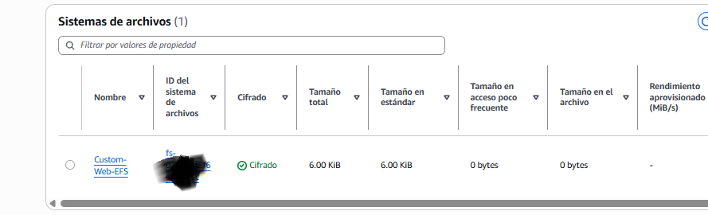


Let's confirm that the EFS is used by the EC2 instance:

```bash
user@DESKTOP-SCNMK3I UCRT64 ~
Mon Oct 05 15:19:14
$ aws ec2-instance-connect ssh --instance-id i-04***f5502d***59e --os-user ec2-user --connection-type direct
The authenticity of host '5*.19.21.162 (54.1**.21.1*2)' can't be established.
ED25519 key fingerprint is: SHA256:JUn13WERydgWS+Bh/KinRoNsF***PBEDozoXE3gk
This key is not known by any other names.
Are you sure you want to continue connecting (yes/no/[fingerprint])? yes
Warning: Permanently added '54.198.21.162' (ED25519) to the list of known hosts.
** WARNING: connection is not using a post-quantum key exchange algorithm.
** This session may be vulnerable to "store now, decrypt later" attacks.
** The server may need to be upgraded. See https://openssh.com/pq.html
   ,     #_
   ~\_  ####_        Amazon Linux 2023
  ~~  \_#####\
  ~~     \###|
  ~~       \#/ ___   https://aws.amazon.com/linux/amazon-linux-2023
   ~~       V~' '->
    ~~~         /
      ~~._.   _/
         _/ _/
       _/m/'
[ec2-user@ip-172-31-**6-242 ~]$
[ec2-user@ip-172-31-**6-242 ~]$
[ec2-user@ip-172-31-**6-242 ~]$ sudo tail -n 100 -f /var/log/cloud-init-output.log
ci-info: ++++++++++++++++++++++++++++++Route IPv4 info++++++++++++++++++++++++++++++
ci-info: +-------+-------------+-------------+-----------------+-----------+-------+
ci-info: | Route | Destination |   Gateway   |     Genmask     | Interface | Flags |
ci-info: +-------+-------------+-------------+-----------------+-----------+-------+
ci-info: |   0   |   0.0.0.0   | 172.31.32.1 |     0.0.0.0     |    ens5   |   UG  |
ci-info: |   1   |  172.31.0.2 | 172.31.32.1 | 255.255.255.255 |    ens5   |  UGH  |
ci-info: |   2   | 172.31.32.0 |   0.0.0.0   |  255.255.240.0  |    ens5   |   U   |
ci-info: |   3   | 172.31.32.1 |   0.0.0.0   | 255.255.255.255 |    ens5   |   UH  |
ci-info: +-------+-------------+-------------+-----------------+-----------+-------+
ci-info: +++++++++++++++++++Route IPv6 info+++++++++++++++++++
ci-info: +-------+-------------+---------+-----------+-------+
ci-info: | Route | Destination | Gateway | Interface | Flags |
ci-info: +-------+-------------+---------+-----------+-------+
ci-info: |   0   |  fe80::/64  |    ::   |    ens5   |   U   |
ci-info: |   2   |    local    |    ::   |    ens5   |   U   |
ci-info: |   3   |  multicast  |    ::   |    ens5   |   U   |
ci-info: +-------+-------------+---------+-----------+-------+
Generating public/private ed25519 key pair.
Your identification has been saved in /etc/ssh/ssh_host_ed25519_key
Your public key has been saved in /etc/ssh/ssh_host_ed25519_key.pub
The key fingerprint is:
SHA256:JUn13WERydgWS+Bh/KinRoNsFW5***EDozoXE3gk root@ip-172-31-**6-242.ec2.internal
The key's randomart image is:
+--[ED25519 256]--+
|        o.+oo=BB=|
|       . E oo*+Bo|
|        * B =.O..|
|         * @ . + |
|        S * +    |
|         * = .   |
|        . . +    |
|           o     |
|          .      |
+----[SHA256]-----+
Generating public/private ecdsa key pair.
Your identification has been saved in /etc/ssh/ssh_host_ecdsa_key
Your public key has been saved in /etc/ssh/ssh_host_ecdsa_key.pub
The key fingerprint is:
SHA256:jPmXQuUE410jnsGYoW8yqCyZypEjGDsbL3AilU03g5c root@ip-172-31-**6-242.ec2.internal
The key's randomart image is:
+---[ECDSA 256]---+
|     . .+=o o    |
|    o Eoo=.= .   |
|   + o.o. *      |
|  o .. = +       |
|..  . = S .      |
|=*o.   *   .     |
|%*o     o o      |
|=*o      o       |
|oo.              |
+----[SHA256]-----+
Cloud-init v. 22.2.2 running 'modules:config' at Tue, 06 Oct 2026 09:31:13 +0000. Up 6.89 seconds.
Cloud-init v. 22.2.2 running 'modules:final' at Tue, 06 Oct 2026 09:31:13 +0000. Up 7.45 seconds.
Created symlink /etc/systemd/system/multi-user.target.wants/httpd.service → /usr/lib/systemd/system/httpd.service.
--2026-10-06 09:32:03--  https://www.tooplate.com/zip-templates/2098_health.zip
Resolving www.tooplate.com (www.tooplate.com)... 172.67.153.129, 104.21.27.191, 2606:4700:3030::6815:1bbf, ...
Connecting to www.tooplate.com (www.tooplate.com)|172.67.153.129|:443... connected.
HTTP request sent, awaiting response... 200 OK
Length: 1521593 (1.5M) [application/zip]
Saving to: ‘2098_health.zip’

     0K .......... .......... .......... .......... ..........  3% 34.7M 0s
    50K .......... .......... .......... .......... ..........  6% 42.6M 0s
   100K .......... .......... .......... .......... .......... 10% 38.8M 0s
   150K .......... .......... .......... .......... .......... 13% 64.3M 0s
   200K .......... .......... .......... .......... .......... 16%  257M 0s
   250K .......... .......... .......... .......... .......... 20% 67.3M 0s
   300K .......... .......... .......... .......... .......... 23% 41.7M 0s
   350K .......... .......... .......... .......... .......... 26%  174M 0s
   400K .......... .......... .......... .......... .......... 30%  122M 0s
   450K .......... .......... .......... .......... .......... 33%  123M 0s
   500K .......... .......... .......... .......... .......... 37%  356M 0s
   550K .......... .......... .......... .......... .......... 40%  208M 0s
   600K .......... .......... .......... .......... .......... 43%  106M 0s
   650K .......... .......... .......... .......... .......... 47%  239M 0s
   700K .......... .......... .......... .......... .......... 50%  112M 0s
   750K .......... .......... .......... .......... .......... 53%  110M 0s
   800K .......... .......... .......... .......... .......... 57%  212M 0s
   850K .......... .......... .......... .......... .......... 60%  179M 0s
   900K .......... .......... .......... .......... .......... 63%  240M 0s
   950K .......... .......... .......... .......... .......... 67%  166M 0s
  1000K .......... .......... .......... .......... .......... 70%  234M 0s
  1050K .......... .......... .......... .......... .......... 74%  321M 0s
  1100K .......... .......... .......... .......... .......... 77%  125M 0s
  1150K .......... .......... .......... .......... .......... 80%  342M 0s
  1200K .......... .......... .......... .......... .......... 84%  280M 0s
  1250K .......... .......... .......... .......... .......... 87%  345M 0s
  1300K .......... .......... .......... .......... .......... 90%  371M 0s
  1350K .......... .......... .......... .......... .......... 94%  249M 0s
  1400K .......... .......... .......... .......... .......... 97%  344M 0s
  1450K .......... .......... .......... .....                100%  361M=0.01s

2026-10-06 09:32:03 (117 MB/s) - ‘2098_health.zip’ saved [1521593/1521593]

fs-043fad096597d0903:/ /mnt/efs efs defaults,_netdev,tls 0 0
/mnt/efs/html /var/www/html none bind,_netdev 0 0
/mnt/efs/logs /var/log/httpd none bind,_netdev 0 0
/mnt/efs is already mounted, please run 'mount' command to verify
Created symlink /etc/systemd/system/multi-user.target.wants/amazon-cloudwatch-agent.service → /etc/systemd/system/amazon-cloudwatch-agent.service.
Cloud-init v. 22.2.2 finished at Tue, 06 Oct 2026 09:32:09 +0000. Datasource DataSourceEc2.  Up 61.46 seconds

^C
[ec2-user@ip-172-31-**6-242 ~]$
[ec2-user@ip-172-31-**6-242 ~]$ df -Th
Filesystem       Type      Size  Used Avail Use% Mounted on
devtmpfs         devtmpfs  4.0M     0  4.0M   0% /dev
tmpfs            tmpfs     457M     0  457M   0% /dev/shm
tmpfs            tmpfs     183M  532K  183M   1% /run
efivarfs         efivarfs  128K  2.7K  121K   3% /sys/firmware/efi/efivars
/dev/nvme0n1p1   xfs       8.0G  2.0G  6.0G  25% /
tmpfs            tmpfs     457M     0  457M   0% /tmp
/dev/nvme0n1p128 vfat       10M  1.3M  8.7M  13% /boot/efi
tmpfs            tmpfs      92M     0   92M   0% /run/user/0
127.0.0.1:/      nfs4      8.0E     0  8.0E   0% /mnt/efs
127.0.0.1:/html  nfs4      8.0E     0  8.0E   0% /var/www/html
127.0.0.1:/logs  nfs4      8.0E     0  8.0E   0% /var/log/httpd
tmpfs            tmpfs      92M     0   92M   0% /run/user/1000
[ec2-user@ip-172-31-**6-242 ~]$
[ec2-user@ip-172-31-**6-242 ~]$
[ec2-user@ip-172-31-**6-242 ~]$ mount | grep efs
tracefs on /sys/kernel/tracing type tracefs (rw,nosuid,nodev,noexec,relatime,seclabel)
sunrpc on /var/lib/nfs/rpc_pipefs type rpc_pipefs (rw,relatime)
127.0.0.1:/ on /mnt/efs type nfs4 (rw,relatime,vers=4.1,rsize=1048576,wsize=1048576,namlen=255,hard,noresvport,fatal_neterrors=none,proto=tcp,port=20304,timeo=600,retrans=2,sec=sys,clientaddr=127.0.0.1,local_lock=none,addr=127.0.0.1)
```

We can also confirm from the web page that the images are visible and this is the appearance:


## 2.3. Spin another EC2 instance with different name

It will use the same EFS:

```bash

user@DESKTOP-SCNMK3I UCRT64 ~
Mon Oct 05 15:49:10
$ ./aws_lab_manager.sh spinup
Enter a choice for the EC2 Instance Name (default: Web-Server-Instance): Web-Server-Instance-01
=============================================================
 CONFIGURATION PARAMETERS (SPINUP):
 Region:            us-east-1
 Security Group:    web-app-sg
 EFS Name:          Custom-Web-EFS
 Instance Type:     t3.micro
 Instance Name:     Web-Server-Instance-01
 Custom AMI ID:     [Amazon Linux 2023 por defecto]
=============================================================
Do you want to start the deployment (spinup) with these parameters? (y/n): y
[INFO][aws_lab_manager.sh]      Starting deployment in region: us-east-1
[INFO][aws_lab_manager.sh]      === 1. Verifying IAM Role and Instance Profile ===
[INFO][aws_lab_manager.sh]      IAM role already exists. Ensuring EFS client policy is attached...
[INFO][aws_lab_manager.sh]      Instance profile already exists.
[INFO][aws_lab_manager.sh]      === 2. Resolving AMI ID ===
[INFO][aws_lab_manager.sh]      No custom AMI provided. Fetching latest Amazon Linux 2023 AMI...
[OK][aws_lab_manager.sh]        Selected AMI: ami-0d***0fb3bac***24
[INFO][aws_lab_manager.sh]      === 3. Creating EC2 Security Group ===
[INFO][aws_lab_manager.sh]      Security group already exists with ID: sg-0***f3d80b***59e7
[INFO][aws_lab_manager.sh]      === 4. Configuring Ingress Rules (HTTP & SSH) ===
[INFO][aws_lab_manager.sh]      === 4.1. Configuring Amazon EFS (Decoupled Security Group & Mount Targets) ===
[INFO][aws_lab_manager.sh]      Creating mount target for subnet subnet-084***5e****c8252...
[INFO][aws_lab_manager.sh]      Mount target for subnet subnet-084***5e****c8252 already exists. Re-using.
[INFO][aws_lab_manager.sh]      Creating mount target for subnet subnet-05***3c4f0e***0f9...
[INFO][aws_lab_manager.sh]      Mount target for subnet subnet-05***3c4f0e***0f9 already exists. Re-using.
[INFO][aws_lab_manager.sh]      Creating mount target for subnet subnet-0***0044eb2***307...
[INFO][aws_lab_manager.sh]      Mount target for subnet subnet-0***0044eb2***307 already exists. Re-using.
[INFO][aws_lab_manager.sh]      Creating mount target for subnet subnet-0be***75eb7***99b...
[INFO][aws_lab_manager.sh]      Mount target for subnet subnet-0be***75eb7***99b already exists. Re-using.
[INFO][aws_lab_manager.sh]      Creating mount target for subnet subnet-019***2751***7a69...
[INFO][aws_lab_manager.sh]      Mount target for subnet subnet-019***2751***7a69 already exists. Re-using.
[INFO][aws_lab_manager.sh]      Creating mount target for subnet subnet-02af***e684a***d7...
[INFO][aws_lab_manager.sh]      Mount target for subnet subnet-02af***e684a***d7 already exists. Re-using.
[INFO][aws_lab_manager.sh]      Waiting for all EFS mount targets to become fully available...
[OK][aws_lab_manager.sh]        All EFS mount targets are now available!
[INFO][aws_lab_manager.sh]      === 5. Generating setup script ===
[INFO][aws_lab_manager.sh]      === 6. Launching EC2 Instance ===
[OK][aws_lab_manager.sh]        Instance created with ID: i-076aef31941903e00. Waiting for 'running' state...
[OK][aws_lab_manager.sh]        Deployment completed successfully! (To create an AMI from this instance, run: ./aws_lab_manager.sh create-ami --instance-id i-076aef31941903e00)
```

Both instances are showing the change, which confirms that they share the same DFS:

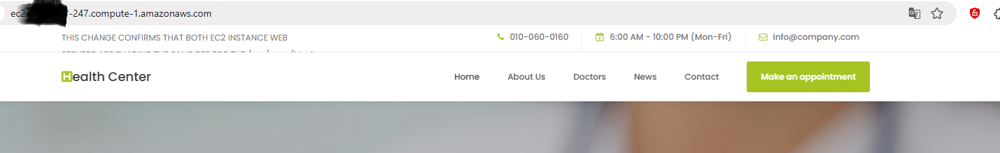


## 2.4. Cleanup the lab

```bash
user@DESKTOP-SCNMK3I UCRT64 ~
Mon Oct 05 15:32:44
$ ./aws_lab_manager.sh spinup
Enter a choice for the EC2 Instance Name (default: Web-Server-Instance): Web-Server-Instance-01
=============================================================
 CONFIGURATION PARAMETERS (SPINUP):
 Region:            us-east-1
 Security Group:    web-app-sg
 EFS Name:          Custom-Web-EFS
 Instance Type:     t3.micro
 Instance Name:     Web-Server-Instance-01
 Custom AMI ID:     [Amazon Linux 2023 por defecto]
=============================================================
Do you want to start the deployment (spinup) with these parameters? (y/n): y
[INFO][aws_lab_manager.sh]      Starting deployment in region: us-east-1
[INFO][aws_lab_manager.sh]      === 1. Verifying IAM Role and Instance Profile ===
[INFO][aws_lab_manager.sh]      IAM role already exists. Ensuring EFS client policy is attached...
[INFO][aws_lab_manager.sh]      Instance profile already exists.
[INFO][aws_lab_manager.sh]      === 2. Resolving AMI ID ===
[INFO][aws_lab_manager.sh]      No custom AMI provided. Fetching latest Amazon Linux 2023 AMI...
[OK][aws_lab_manager.sh]        Selected AMI: ami-0d***0fb3bac***24
[INFO][aws_lab_manager.sh]      === 3. Creating EC2 Security Group ===
[INFO][aws_lab_manager.sh]      Security group already exists with ID: sg-0***f3d80b***59e7
[INFO][aws_lab_manager.sh]      === 4. Configuring Ingress Rules (HTTP & SSH) ===
[INFO][aws_lab_manager.sh]      === 4.1. Configuring Amazon EFS (Decoupled Security Group & Mount Targets) ===
[INFO][aws_lab_manager.sh]      Creating mount target for subnet subnet-084***5e****c8252...
[INFO][aws_lab_manager.sh]      Mount target for subnet subnet-084***5e****c8252 already exists. Re-using.
[INFO][aws_lab_manager.sh]      Creating mount target for subnet subnet-05***3c4f0e***0f9...
[INFO][aws_lab_manager.sh]      Mount target for subnet subnet-05***3c4f0e***0f9 already exists. Re-using.
[INFO][aws_lab_manager.sh]      Creating mount target for subnet subnet-0***0044eb2***307...
[INFO][aws_lab_manager.sh]      Mount target for subnet subnet-0***0044eb2***307 already exists. Re-using.
[INFO][aws_lab_manager.sh]      Creating mount target for subnet subnet-0be***75eb7***99b...
[INFO][aws_lab_manager.sh]      Mount target for subnet subnet-0be***75eb7***99b already exists. Re-using.
[INFO][aws_lab_manager.sh]      Creating mount target for subnet subnet-019***2751***7a69...
[INFO][aws_lab_manager.sh]      Mount target for subnet subnet-019***2751***7a69 already exists. Re-using.
[INFO][aws_lab_manager.sh]      Creating mount target for subnet subnet-02af***e684a***d7...
[INFO][aws_lab_manager.sh]      Mount target for subnet subnet-02af***e684a***d7 already exists. Re-using.
[INFO][aws_lab_manager.sh]      Waiting for all EFS mount targets to become fully available...
[OK][aws_lab_manager.sh]        All EFS mount targets are now available!
[INFO][aws_lab_manager.sh]      === 5. Generating setup script ===
[INFO][aws_lab_manager.sh]      === 6. Launching EC2 Instance ===
[OK][aws_lab_manager.sh]        Instance created with ID: i-076aef31941903e00. Waiting for 'running' state...
[OK][aws_lab_manager.sh]        Deployment completed successfully! (To create an AMI from this instance, run: ./aws_lab_manager.sh create-ami --instance-id i-076aef31941903e00)

user@DESKTOP-SCNMK3I UCRT64 ~
Tue Oct 06 11:37:04
$

user@DESKTOP-SCNMK3I UCRT64 ~
Tue Oct 06 11:37:42
$ ./aws_lab_manager.sh cleanup
=============================================================
 CONFIGURATION PARAMETERS (CLEANUP):
 Region:            us-east-1
 Security Group:    web-app-sg
 EFS Name:          Custom-Web-EFS
=============================================================
Do you want to start the cleanup of the resources? (y/n): y
[INFO][aws_lab_manager.sh]      Starting universal cleanup in region: us-east-1
[INFO][aws_lab_manager.sh]      Step 0/8 — Deregistering custom/user AMIs...
[INFO][aws_lab_manager.sh]      Step 1/8 — Terminating active EC2 instances...
{
    "TerminatingInstances": [
        {
            "InstanceId": "i-076aef31941903e00",
            "CurrentState": {
                "Code": 32,
                "Name": "shutting-down"
            },
            "PreviousState": {
                "Code": 16,
                "Name": "running"
            }
        }
    ]
}

[OK][aws_lab_manager.sh]        -> Terminated EC2 Instance ID: i-076aef31941903e00
{
    "TerminatingInstances": [
        {
            "InstanceId": "i-04***f5502d***59e",
            "CurrentState": {
                "Code": 32,
                "Name": "shutting-down"
            },
            "PreviousState": {
                "Code": 16,
                "Name": "running"
            }
        }
    ]
}

[OK][aws_lab_manager.sh]        -> Terminated EC2 Instance ID: i-04***f5502d***59e
[INFO][aws_lab_manager.sh]      Waiting for EC2 instances to fully terminate...
[INFO][aws_lab_manager.sh]      Step 2/8 — Deleting EFS File Systems and Mount Targets...
[INFO][aws_lab_manager.sh]      Waiting for mount targets of EFS fs-043fad096597d0903 to delete...
[OK][aws_lab_manager.sh]        -> Deleted EFS File System ID: fs-043fad096597d0903
[INFO][aws_lab_manager.sh]      Step 3/8 — Finding and deleting Load Balancers...
[INFO][aws_lab_manager.sh]      Step 4/8 — Finding and deleting Auto Scaling Groups...
[INFO][aws_lab_manager.sh]      Step 5/8 — Finding and deleting Target Groups...
[INFO][aws_lab_manager.sh]      Step 6/8 — Finding and deleting Launch Templates...
[INFO][aws_lab_manager.sh]      Step 7/8 — Removing all ingress/egress rules and deleting Security Groups...
[INFO][aws_lab_manager.sh]      Revoking rules for Security Group: sg-0***f3d80b***59e7
{
    "Return": true,
    "RevokedSecurityGroupRules": [
        {
            "SecurityGroupRuleId": "sgr-01b***570dd***010",
            "GroupId": "sg-0***f3d80b***59e7",
            "IsEgress": false,
            "IpProtocol": "tcp",
            "FromPort": 80,
            "ToPort": 80,
            "CidrIpv4": "0.0.0.0/0"
        },
        {
            "SecurityGroupRuleId": "sgr-04b****66f04***de3",
            "GroupId": "sg-0***f3d80b***59e7",
            "IsEgress": false,
            "IpProtocol": "tcp",
            "FromPort": 22,
            "ToPort": 22,
            "CidrIpv4": "89.6.240.132/32"
        }
    ]
}

{
    "Return": true,
    "RevokedSecurityGroupRules": [
        {
            "SecurityGroupRuleId": "sgr-0a6***c1bed7***12",
            "GroupId": "sg-0***f3d80b***59e7",
            "IsEgress": true,
            "IpProtocol": "-1",
            "FromPort": -1,
            "ToPort": -1,
            "CidrIpv4": "0.0.0.0/0"
        }
    ]
}

[INFO][aws_lab_manager.sh]      Revoking rules for Security Group: sg-0d***791a4d***268
{
    "Return": true,
    "RevokedSecurityGroupRules": [
        {
            "SecurityGroupRuleId": "sgr-06c***e1a8b***39b",
            "GroupId": "sg-0d***791a4d***268",
            "IsEgress": false,
            "IpProtocol": "tcp",
            "FromPort": 2049,
            "ToPort": 2049,
            "CidrIpv4": "172.31.0.0/16"
        }
    ]
}

{
    "Return": true,
    "RevokedSecurityGroupRules": [
        {
            "SecurityGroupRuleId": "sgr-087***35e02***0d9",
            "GroupId": "sg-0d***791a4d***268",
            "IsEgress": true,
            "IpProtocol": "-1",
            "FromPort": -1,
            "ToPort": -1,
            "CidrIpv4": "0.0.0.0/0"
        }
    ]
}

{
    "Return": true,
    "GroupId": "sg-0***f3d80b***59e7"
}

[OK][aws_lab_manager.sh]        -> Deleted Security Group ID: sg-0***f3d80b***59e7
{
    "Return": true,
    "GroupId": "sg-0d***791a4d***268"
}

[OK][aws_lab_manager.sh]        -> Deleted Security Group ID: sg-0d***791a4d***268
[INFO][aws_lab_manager.sh]      Step 8/8 — Cleaning up CloudWatch logs...
[OK][aws_lab_manager.sh]        Universal cleanup completed successfully!
```


### 3. Add an autoscaling group to the spinup mix

We can double the bet and use an Auto Scaling Group (ASG) to spin up multiple instances of the same configuration. This will allow us to automatically scale the number of instances based on demand.

We can use the `aws_lab_manager_with_autoscaling_group.sh` script to spin up the instances with an ASG. The script will create a launch template and an auto-scaling group that will manage the instances:

```bash
user@DESKTOP-SCNMK3I UCRT64 ~
Mon Oct 05 15:49:10
$ ./aws_lab_manager_with_autoscaling_group.sh spinup
Enter a choice for the EC2 / ASG Name Prefix (default: Web-Server-Instance):
=============================================================
 CONFIGURATION PARAMETERS (SPINUP VIA ASG):
 Region:            us-east-1
 Security Group:    web-app-sg
 EFS Name:          Custom-Web-EFS
 Instance Type:     t3.micro
 ASG Name:          Web-App-ASG
 Launch Template:   Web-App-Launch-Template
 Custom AMI ID:     [Amazon Linux 2023 por defecto]
=============================================================
Do you want to start the deployment with an Auto Scaling Group? (y/n): y
[INFO][aws_lab_manager_with_autoscaling_group.sh]      Starting deployment in region: us-east-1
[INFO][aws_lab_manager_with_autoscaling_group.sh]      === 1. Verifying IAM Role and Instance Profile ===
[INFO][aws_lab_manager_with_autoscaling_group.sh]      IAM role already exists. Ensuring EFS client policy is attached...
[INFO][aws_lab_manager_with_autoscaling_group.sh]      Instance profile already exists.
[INFO][aws_lab_manager_with_autoscaling_group.sh]      === 2. Resolving AMI ID ===
[INFO][aws_lab_manager_with_autoscaling_group.sh]      No custom AMI provided. Fetching latest Amazon Linux 2023 AMI...
[OK][aws_lab_manager_with_autoscaling_group.sh]        Selected AMI: ami-0d***0fb3bac***24
[INFO][aws_lab_manager_with_autoscaling_group.sh]      === 3. Creating EC2 Security Group ===
[OK][aws_lab_manager_with_autoscaling_group.sh]        Security group created with ID: sg-0446****b555***a87
[INFO][aws_lab_manager_with_autoscaling_group.sh]      === 4. Configuring Ingress Rules (HTTP & SSH) ===
{
    "Return": true,
    "SecurityGroupRules": [
        {
            "SecurityGroupRuleId": "sgr-0ff5f87b79****e72",
            "GroupId": "sg-0446****b555***a87",
            "GroupOwnerId": "430***0559**",
            "IsEgress": false,
            "IpProtocol": "tcp",
            "FromPort": 80,
            "ToPort": 80,
            "CidrIpv4": "0.0.0.0/0",
            "SecurityGroupRuleArn": "arn:aws:ec2:us-east-1:430***0559**:security-group-rule/sgr-0ff5f87b79****e72"
        }
    ]
}

{
    "Return": true,
    "SecurityGroupRules": [
        {
            "SecurityGroupRuleId": "sgr-0f8dc047cb****fe5",
            "GroupId": "sg-0446****b555***a87",
            "GroupOwnerId": "430***0559**",
            "IsEgress": false,
            "IpProtocol": "tcp",
            "FromPort": 22,
            "ToPort": 22,
            "CidrIpv4": "89.6.240.132/32",
            "SecurityGroupRuleArn": "arn:aws:ec2:us-east-1:430***0559**:security-group-rule/sgr-0f8dc047cb****fe5"
        }
    ]
}

[INFO][aws_lab_manager_with_autoscaling_group.sh]      === 4.1. Configuring Amazon EFS (Decoupled Security Group & Mount Targets) ===
{
    "Return": true,
    "SecurityGroupRules": [
        {
            "SecurityGroupRuleId": "sgr-0f2e0da69****c7a8",
            "GroupId": "sg-03a68c209****dce",
            "GroupOwnerId": "430***0559**",
            "IsEgress": false,
            "IpProtocol": "tcp",
            "FromPort": 2049,
            "ToPort": 2049,
            "CidrIpv4": "172.31.0.0/16",
            "SecurityGroupRuleArn": "arn:aws:ec2:us-east-1:430***0559**:security-group-rule/sgr-0f2e0da69****c7a8"
        }
    ]
}

[INFO][aws_lab_manager_with_autoscaling_group.sh]      Creating mount target for subnet subnet-084***5e****c8252...
[INFO][aws_lab_manager_with_autoscaling_group.sh]      Creating mount target for subnet subnet-05***3c4f0e***0f9...
[INFO][aws_lab_manager_with_autoscaling_group.sh]      Creating mount target for subnet subnet-0***0044eb2***307...
[INFO][aws_lab_manager_with_autoscaling_group.sh]      Creating mount target for subnet subnet-0be***75eb7***99b...
[INFO][aws_lab_manager_with_autoscaling_group.sh]      Creating mount target for subnet subnet-019***2751***7a69...
[INFO][aws_lab_manager_with_autoscaling_group.sh]      Creating mount target for subnet subnet-02af***e684a***d7...
[INFO][aws_lab_manager_with_autoscaling_group.sh]      Waiting for all EFS mount targets to become fully available...
[OK][aws_lab_manager_with_autoscaling_group.sh]        All EFS mount targets are now available!
[INFO][aws_lab_manager_with_autoscaling_group.sh]      === 5. Generating setup script ===
[INFO][aws_lab_manager_with_autoscaling_group.sh]      === 6. Creating Launch Template ===
[OK][aws_lab_manager_with_autoscaling_group.sh]        Launch Template 'Web-App-Launch-Template' created successfully.
[INFO][aws_lab_manager_with_autoscaling_group.sh]      === 7. Creating Auto Scaling Group (ASG) ===
[OK][aws_lab_manager_with_autoscaling_group.sh]        Auto Scaling Group 'Web-App-ASG' created successfully!
[OK][aws_lab_manager_with_autoscaling_group.sh]        Deployment completed via ASG! Instances are spinning up automatically.
```
Here is the result:

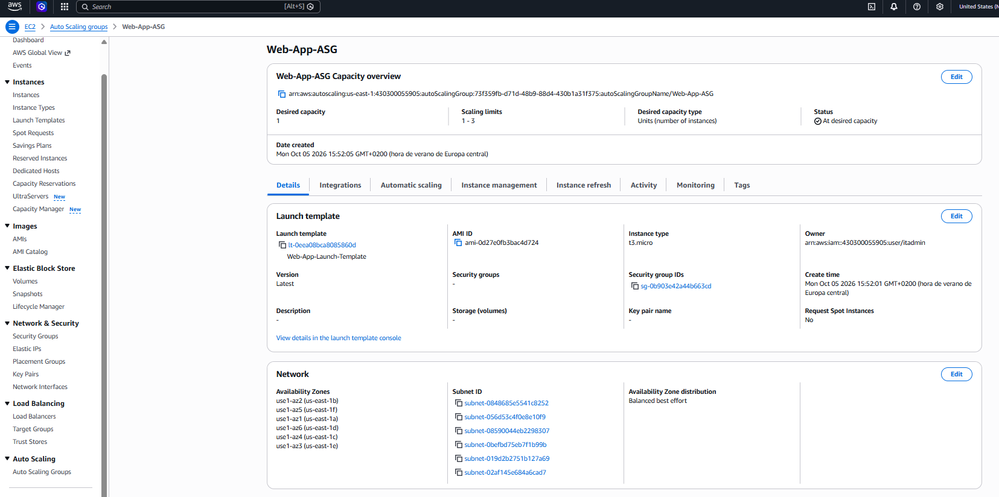

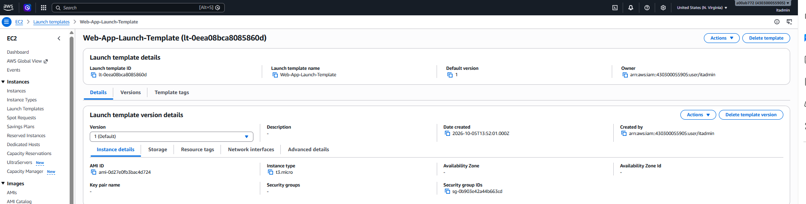

## 4. Optional, add a load balancer to the spinup mix

I didn't create a load balancer to avoid costs, but that would be easy, either this way.

* Create a Target Group

```bash
TG_ARN=$(aws elbv2 create-target-group \
--name web-app-tg \
--protocol HTTP \
--port 80 \
--vpc-id "$VPC_ID" \
--target-type instance \
--query "TargetGroups[0].TargetGroupArn" \
--output text)
```

* Create the Application Load Balancer

```bash
ALB_ARN=$(aws elbv2 create-load-balancer \
--name web-app-alb \
--subnets $SUBNET_IDS \
--security-groups "$SG_ID" \
--query "LoadBalancers[0].LoadBalancerArn" \
--output text)
```

* Create a Listener to Forward Port 80 Traffic to the Target Group

```bash
aws elbv2 create-listener \
--load-balancer-arn "$ALB_ARN" \
--protocol HTTP \
--port 80 \
--default-actions Type=forward,TargetGroupArn="$TG_ARN"
```

* Link the ASG to the Target Group
  To make your Auto Scaling Group automatically register its instances with this load balancer, update your ASG configuration to include the Target Group ARN:

```bash
aws autoscaling update-auto-scaling-group \
--auto-scaling-group-name "$ASG_NAME" \
--target-group-arns "$TG_ARN"
```

## 4.1. Clean up the lab

```bash
user@DESKTOP-SCNMK3I UCRT64 ~
Mon Oct 05 15:52:04
$ ./aws_lab_manager_with_autoscaling_group.sh cleanup
=============================================================
 CONFIGURATION PARAMETERS (CLEANUP):
 Region:            us-east-1
 Security Group:    web-app-sg
 EFS Name:          Custom-Web-EFS
=============================================================
Do you want to start the cleanup of all resources including ASG and LT? (y/n): y
[INFO][aws_lab_manager_with_autoscaling_group.sh]      Starting universal cleanup in region: us-east-1
[INFO][aws_lab_manager_with_autoscaling_group.sh]      Step 0/9 — Deregistering custom/user AMIs...
[INFO][aws_lab_manager_with_autoscaling_group.sh]      Step 1/9 — Finding and deleting Auto Scaling Groups...
[OK][aws_lab_manager_with_autoscaling_group.sh]        -> Deleted ASG: Web-App-ASG
[INFO][aws_lab_manager_with_autoscaling_group.sh]      Step 2/9 — Finding and deleting Launch Templates...
{
    "LaunchTemplate": {
        "LaunchTemplateId": "lt-02b9599abb3703cbb",
        "LaunchTemplateName": "Web-App-Launch-Template",
        "CreateTime": "2026-10-06T09:48:32+00:00",
        "CreatedBy": "arn:aws:iam::430***0559**:user/itadmin",
        "DefaultVersionNumber": 1,
        "LatestVersionNumber": 1,
        "Operator": {
            "Managed": false
        }
    }
}

[OK][aws_lab_manager_with_autoscaling_group.sh]        -> Deleted Launch Template: Web-App-Launch-Template
[INFO][aws_lab_manager_with_autoscaling_group.sh]      Step 3/9 — Terminating any remaining active EC2 instances...
[INFO][aws_lab_manager_with_autoscaling_group.sh]      Step 4/9 — Deleting EFS File Systems and Mount Targets...
[INFO][aws_lab_manager_with_autoscaling_group.sh]      Waiting for mount targets of EFS fs-0e9727d90f0799728 to delete...
[OK][aws_lab_manager_with_autoscaling_group.sh]        -> Deleted EFS File System ID: fs-0e9727d90f0799728
[INFO][aws_lab_manager_with_autoscaling_group.sh]      Step 5/9 — Finding and deleting Load Balancers...
[INFO][aws_lab_manager_with_autoscaling_group.sh]      Step 6/9 — Finding and deleting Target Groups...
[INFO][aws_lab_manager_with_autoscaling_group.sh]      Step 7/9 — Removing all ingress/egress rules and deleting Security Groups...
[INFO][aws_lab_manager_with_autoscaling_group.sh]      Revoking rules for Security Group: sg-03a68c209****dce
{
    "Return": true,
    "RevokedSecurityGroupRules": [
        {
            "SecurityGroupRuleId": "sgr-0f2e0da69****c7a8",
            "GroupId": "sg-03a68c209****dce",
            "IsEgress": false,
            "IpProtocol": "tcp",
            "FromPort": 2049,
            "ToPort": 2049,
            "CidrIpv4": "172.31.0.0/16"
        }
    ]
}

{
    "Return": true,
    "RevokedSecurityGroupRules": [
        {
            "SecurityGroupRuleId": "sgr-065012dc50****c3c",
            "GroupId": "sg-03a68c209****dce",
            "IsEgress": true,
            "IpProtocol": "-1",
            "FromPort": -1,
            "ToPort": -1,
            "CidrIpv4": "0.0.0.0/0"
        }
    ]
}

[INFO][aws_lab_manager_with_autoscaling_group.sh]      Revoking rules for Security Group: sg-0446****b555***a87
{
    "Return": true,
    "RevokedSecurityGroupRules": [
        {
            "SecurityGroupRuleId": "sgr-0ff5f87b79****e72",
            "GroupId": "sg-0446****b555***a87",
            "IsEgress": false,
            "IpProtocol": "tcp",
            "FromPort": 80,
            "ToPort": 80,
            "CidrIpv4": "0.0.0.0/0"
        },
        {
            "SecurityGroupRuleId": "sgr-0f8dc047cb****fe5",
            "GroupId": "sg-0446****b555***a87",
            "IsEgress": false,
            "IpProtocol": "tcp",
            "FromPort": 22,
            "ToPort": 22,
            "CidrIpv4": "89.6.240.132/32"
        }
    ]
}

{
    "Return": true,
    "RevokedSecurityGroupRules": [
        {
            "SecurityGroupRuleId": "sgr-0db835a5ac****79a",
            "GroupId": "sg-0446****b555***a87",
            "IsEgress": true,
            "IpProtocol": "-1",
            "FromPort": -1,
            "ToPort": -1,
            "CidrIpv4": "0.0.0.0/0"
        }
    ]
}

{
    "Return": true,
    "GroupId": "sg-03a68c209****dce"
}

[OK][aws_lab_manager_with_autoscaling_group.sh]        -> Deleted Security Group ID: sg-03a68c209****dce
{
    "Return": true,
    "GroupId": "sg-0446****b555***a87"
}

[OK][aws_lab_manager_with_autoscaling_group.sh]        -> Deleted Security Group ID: sg-0446****b555***a87
[INFO][aws_lab_manager_with_autoscaling_group.sh]      Step 8/9 — Cleaning up CloudWatch logs...
[OK][aws_lab_manager_with_autoscaling_group.sh]        Universal cleanup completed successfully!
```
