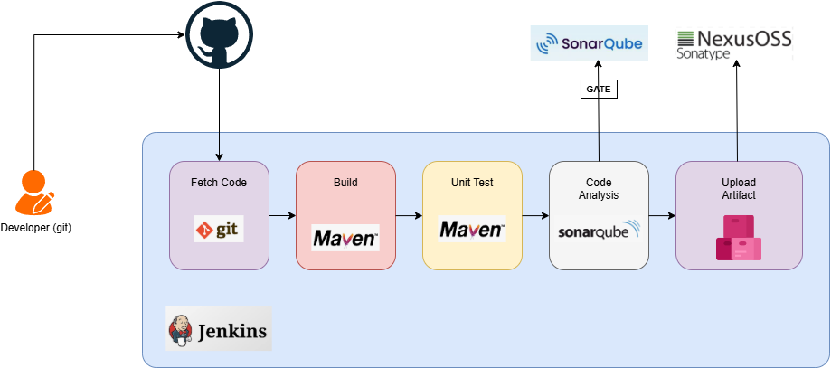
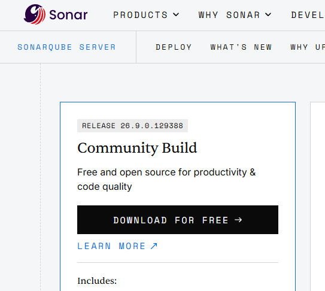
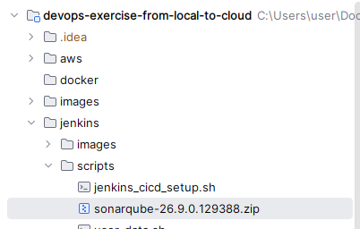
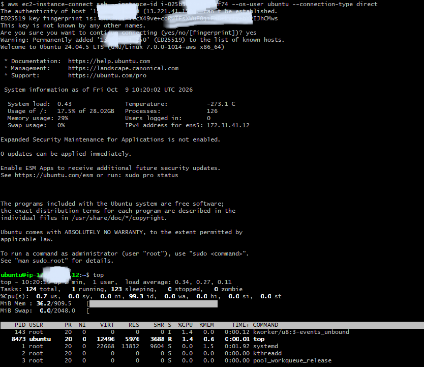
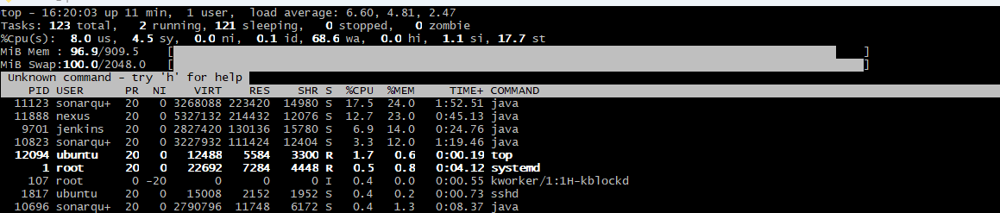
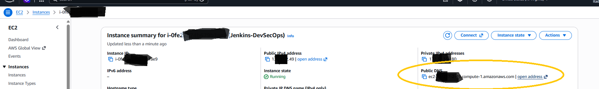
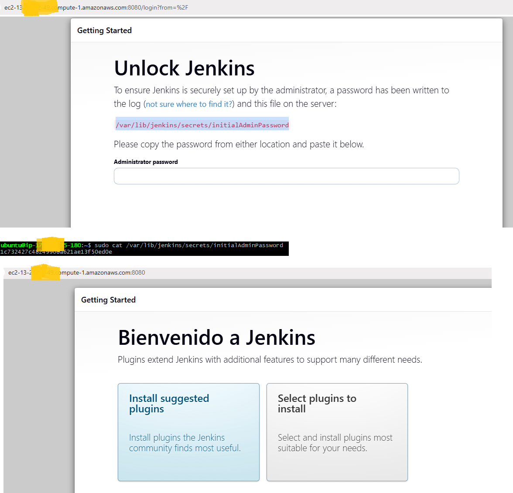

# CI/CD using Jenkins

In this section, we will provide a detailed explanation of how we implement CI/CD automation for our web application on AWS using Jenkins.



# Jenkins CI setup

Note: before you run the script you need to download the sonarqube zip from the UI, the site doesn't allow automated downloads:

https://www.sonarsource.com/products/sonarqube/downloads/



The script must be placed in the same folder where the [jenkins_cicd_setup.sh](scripts/jenkins_cicd_setup.sh) script is located:



You can use the provided [jenkins_cicd_setup.sh](scripts/jenkins_cicd_setup.sh) bash script to provision a free tier ubuntu host with 30Gb of disk. Make sure the zip file name in the script matches with the sonarqube-*.zip that you download.

The script will take care on your behalf of the following items:

* Jenkins setup.
* Nexus setup.
* SonarQube setup.
* Security Group configuration.

```bash

user@DESKTOP-SCNMK3I UCRT64 ~/Documents/devops-exercise-from-local-to-cloud/jenkins/scripts (main)
Fri Oct 09 12:15:57
$ ./jenkins_cicd_setup.sh
Usage: ./jenkins_cicd_setup.sh {provision|teardown}

user@DESKTOP-SCNMK3I UCRT64 ~/Documents/devops-exercise-from-local-to-cloud/jenkins/scripts (main)
Fri Oct 09 12:17:16
$ ./jenkins_cicd_setup.sh provision
[2026-10-09 17:30:46] Checking/Creating Security Group...
[2026-10-09 17:30:49] Fetching your public IP address...
[2026-10-09 17:30:49] Restricting inbound access to your IP: 8*.**6.240.132/32
[2026-10-09 17:30:49] Opening inbound ports...
[2026-10-09 17:30:55] Checking/Configuring IAM Instance Profile...
[2026-10-09 17:31:02] Waiting for IAM instance profile propagation...
[2026-10-09 17:31:05] The zip file already exists in the s3://jenkins-sonarqube-binaries-22851/ S3 bucket and it is accessible. We skip the upload to save costs.
[2026-10-09 17:31:05] Fetching latest Ubuntu AMI...
[2026-10-09 17:31:06] Waiting 10 seconds for IAM profile propagation to EC2...
[2026-10-09 17:31:16] Launching EC2 Instance with 30GB gp3 storage...
[2026-10-09 17:31:19] Successfully provisioned instance ID: i-063***********1dc

```

Connect to the instance and check the memory consumption:

```bash
user@DESKTOP-SCNMK3I UCRT64 ~/Documents/devops-exercise-from-local-to-cloud/jenkins/scripts (main)
Fri Oct 09 12:19:13
$ aws ec2-instance-connect ssh --instance-id i-063***********1dc --os-user ubuntu --connection-type direct

$ top
```

Confirm that the Jenkins, ports are in use by the services:

```bash
ubuntu@ip-172-31-35-180:~$ sudo ss -tulpn
Netid             State              Recv-Q             Send-Q                               Local Address:Port                            Peer Address:Port             Process
udp               UNCONN             0                  0                                       127.0.0.54:53                                   0.0.0.0:*                 users:(("systemd-resolve",pid=326,fd=16))
udp               UNCONN             0                  0                                    127.0.0.53%lo:53                                   0.0.0.0:*                 users:(("systemd-resolve",pid=326,fd=14))
udp               UNCONN             0                  0                               172.31.35.180%ens5:68                                   0.0.0.0:*                 users:(("systemd-network",pid=538,fd=21))
udp               UNCONN             0                  0                                        127.0.0.1:323                                  0.0.0.0:*                 users:(("chronyd",pid=815,fd=5))
udp               UNCONN             0                  0                                            [::1]:323                                     [::]:*                 users:(("chronyd",pid=815,fd=6))
tcp               LISTEN             0                  4096                                       0.0.0.0:22                                   0.0.0.0:*                 users:(("sshd",pid=999,fd=3),("systemd",pid=1,fd=145))
tcp               LISTEN             0                  4096                                 127.0.0.53%lo:53                                   0.0.0.0:*                 users:(("systemd-resolve",pid=326,fd=15))
tcp               LISTEN             0                  4096                                    127.0.0.54:53                                   0.0.0.0:*                 users:(("systemd-resolve",pid=326,fd=17))
tcp               LISTEN             0                  4096                                          [::]:22                                      [::]:*                 users:(("sshd",pid=999,fd=4),("systemd",pid=1,fd=146))
tcp               LISTEN             0                  4096                            [::ffff:127.0.0.1]:36431                                      *:*                 users:(("java",pid=10823,fd=279))
tcp               LISTEN             0                  25                                               *:9000                                       *:*                 users:(("java",pid=11123,fd=13))
tcp               LISTEN             0                  50                              [::ffff:127.0.0.1]:9092                                       *:*                 users:(("java",pid=11123,fd=14))
tcp               LISTEN             0                  1                               [::ffff:127.0.0.1]:35285                                      *:*                 users:(("java",pid=10613,fd=111))
tcp               LISTEN             0                  4096                            [::ffff:127.0.0.1]:9001                                       *:*                 users:(("java",pid=10823,fd=281))
tcp               LISTEN             0                  50                                               *:8080                                       *:*                 users:(("java",pid=9701,fd=9))
```

Check the installation log:

```bash
ubuntu@ip-172-31-35-180:~$ sudo tail -f /var/log/user-data.log
[User-Data] Setting up daily shutdown cron job...
++ curl -s http://169.254.169.254/latest/meta-data/instance-id
+ INSTANCE_ID=
++ curl -s http://169.254.169.254/latest/meta-data/placement/region
+ REGION=
+ echo '0 0 * * * root aws ec2 stop-instances --instance-ids  --region '
+ chmod 644 /etc/cron.d/daily-shutdown
+ log 'Provisioning complete!'
+ echo '[User-Data] Provisioning complete!'
[User-Data] Provisioning complete!
^C

```

Check the services are running

```bash
ubuntu@ip-172-31-35-180:~$ sudo systemctl status jenkins
● jenkins.service - Jenkins Continuous Integration Server
     Loaded: loaded (/usr/lib/systemd/system/jenkins.service; enabled; preset: enabled)
     Active: active (running) since Fri 2026-10-09 16:10:53 UTC; 1min 5s ago
   Main PID: 9701 (java)
      Tasks: 37 (limit: 627)
     Memory: 29.0M (peak: 352.1M swap: 286.8M swap peak: 299.3M)
        CPU: 20.795s
     CGroup: /system.slice/jenkins.service
             └─9701 /usr/bin/java -Djava.awt.headless=true -jar /usr/share/java/jenkins.war --webroot=/var/cache/jenkins/war --httpPort=8080

Oct 09 16:10:48 ip-172-31-35-180 jenkins[9701]: [LF]> This may also be found at: /var/lib/jenkins/secrets/initialAdminPassword
Oct 09 16:10:48 ip-172-31-35-180 jenkins[9701]: [LF]>
Oct 09 16:10:48 ip-172-31-35-180 jenkins[9701]: [LF]> *************************************************************
Oct 09 16:10:48 ip-172-31-35-180 jenkins[9701]: [LF]> *************************************************************
Oct 09 16:10:48 ip-172-31-35-180 jenkins[9701]: [LF]> *************************************************************
Oct 09 16:10:53 ip-172-31-35-180 jenkins[9701]: 2026-10-09 16:10:53.122+0000 [id=34]        INFO        jenkins.InitReactorRunner$1#onAttained: Completed initialization
Oct 09 16:10:53 ip-172-31-35-180 jenkins[9701]: 2026-10-09 16:10:53.215+0000 [id=24]        INFO        hudson.lifecycle.Lifecycle#onReady: Jenkins is fully up and running
Oct 09 16:10:53 ip-172-31-35-180 systemd[1]: Started jenkins.service - Jenkins Continuous Integration Server.
Oct 09 16:10:53 ip-172-31-35-180 jenkins[9701]: 2026-10-09 16:10:53.360+0000 [id=50]        INFO        h.m.DownloadService$Downloadable#load: Obtained the updated data file for hudson.tasks.Maven.MavenInstaller
Oct 09 16:10:53 ip-172-31-35-180 jenkins[9701]: 2026-10-09 16:10:53.363+0000 [id=50]        INFO        hudson.util.Retrier#start: Performed the action check updates server successfully at the attempt #1
ubuntu@ip-172-31-35-180:~$ ^C
ubuntu@ip-172-31-35-180:~$
ubuntu@ip-172-31-35-180:~$ sudo systemctl status nexus
● nexus.service - Nexus Service
     Loaded: loaded (/etc/systemd/system/nexus.service; enabled; preset: enabled)
     Active: active (running) since Fri 2026-10-09 16:11:15 UTC; 56s ago
   Main PID: 10613 (java)
      Tasks: 42 (limit: 627)
     Memory: 385.0M (peak: 428.7M swap: 303.9M swap peak: 307.3M)
        CPU: 30.600s
     CGroup: /system.slice/nexus.service
             └─10613 /usr/lib/jvm/java-1.17.0-openjdk-amd64/bin/java -server -Dinstall4j.jvmDir=/usr/lib/jvm/java-1.17.0-openjdk-amd64 -Dexe4j.moduleName=/opt/nexus/bin/nexus -XX:+UnlockDiagnosticVMOptions -Dinstall4j.launcherId=246 -Di>

Oct 09 16:11:14 ip-172-31-35-180 systemd[1]: Starting nexus.service - Nexus Service...
Oct 09 16:11:15 ip-172-31-35-180 nexus[10246]: Starting nexus
Oct 09 16:11:15 ip-172-31-35-180 systemd[1]: Started nexus.service - Nexus Service.

ubuntu@ip-172-31-35-180:~$
ubuntu@ip-172-31-35-180:~$
ubuntu@ip-172-31-35-180:~$ sudo systemctl status sonarqube
● sonarqube.service - SonarQube service
     Loaded: loaded (/etc/systemd/system/sonarqube.service; enabled; preset: enabled)
     Active: active (running) since Fri 2026-10-09 16:11:15 UTC; 1min 4s ago
    Process: 10673 ExecStart=/opt/sonarqube/bin/linux-x86-64/sonar.sh start (code=exited, status=0/SUCCESS)
   Main PID: 10696 (java)
      Tasks: 56 (limit: 627)
     Memory: 318.9M (peak: 485.8M swap: 466.3M swap peak: 533.8M)
        CPU: 37.908s
     CGroup: /system.slice/sonarqube.service
             ├─10696 java --add-exports=java.base/jdk.internal.ref=ALL-UNNAMED --add-opens=java.base/java.lang=ALL-UNNAMED --add-opens=java.base/java.nio=ALL-UNNAMED --add-opens=java.base/sun.nio.ch=ALL-UNNAMED --add-opens=java.manageme>
             ├─10742 /usr/lib/jvm/java-21-openjdk-amd64/bin/java -Xms4m -Xmx64m -XX:+UseSerialGC -cp "/opt/sonarqube/elasticsearch/lib/tools/server-launcher/*" org.elasticsearch.server.launcher.ServerLauncher
             └─10823 /usr/lib/jvm/java-21-openjdk-amd64/bin/java -Des.networkaddress.cache.ttl=60 -Des.networkaddress.cache.negative.ttl=10 -XX:+AlwaysPreTouch -Xss1m -Djava.awt.headless=true -Dfile.encoding=UTF-8 -Djna.nosys=true -XX:->

Oct 09 16:11:15 ip-172-31-35-180 systemd[1]: Starting sonarqube.service - SonarQube service...
Oct 09 16:11:15 ip-172-31-35-180 sonar.sh[10673]: /usr/bin/java
Oct 09 16:11:15 ip-172-31-35-180 sonar.sh[10673]: Starting SonarQube...
Oct 09 16:11:15 ip-172-31-35-180 sonar.sh[10673]: Started SonarQube.
Oct 09 16:11:15 ip-172-31-35-180 systemd[1]: Started sonarqube.service - SonarQube service.

```

If any of the services has trouble, check the journal log:

```bash
sudo journalctl -u jenkins.service -n 50 --no-pager
sudo journalctl -u nexus.service -n 50 --no-pager
sudo journalctl -u sonarqube.service -n 50 --no-pager
```



Be aware that you may be interested in using a t4g.micro or using more than one ec2 instance, or a medium size image:



Enter instance and get the public dns:



Configure Jenkins for the first time:



* Plugins installation.
* Integrate Nexus and SonarQube with Jenkins.
* Write the pipeline script.
* Set notification if pipeline fails.

