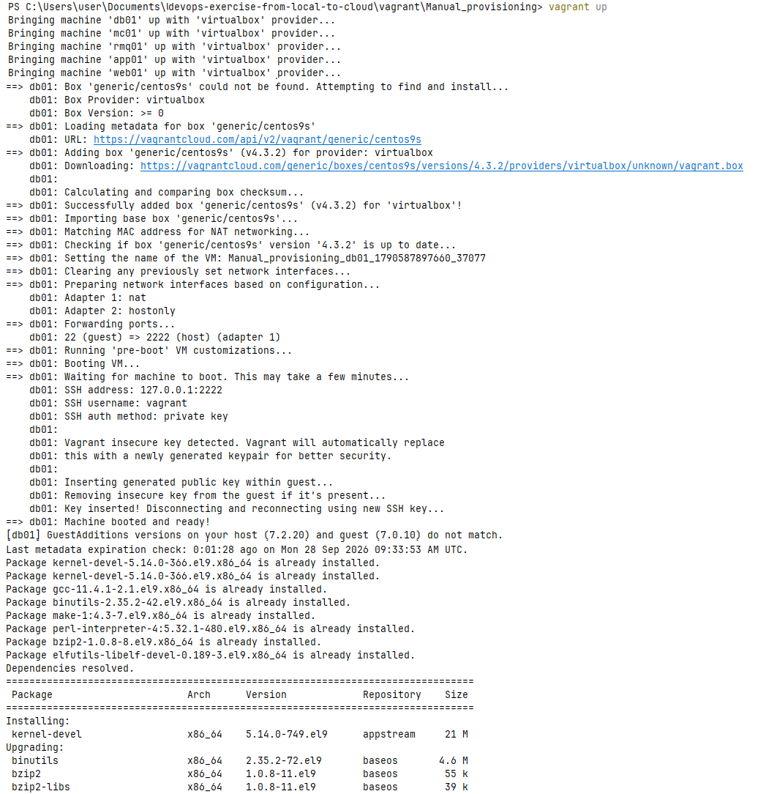
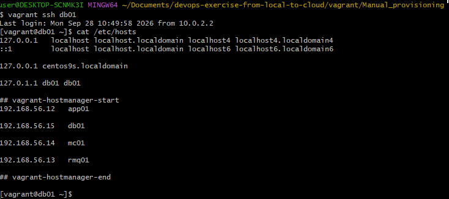
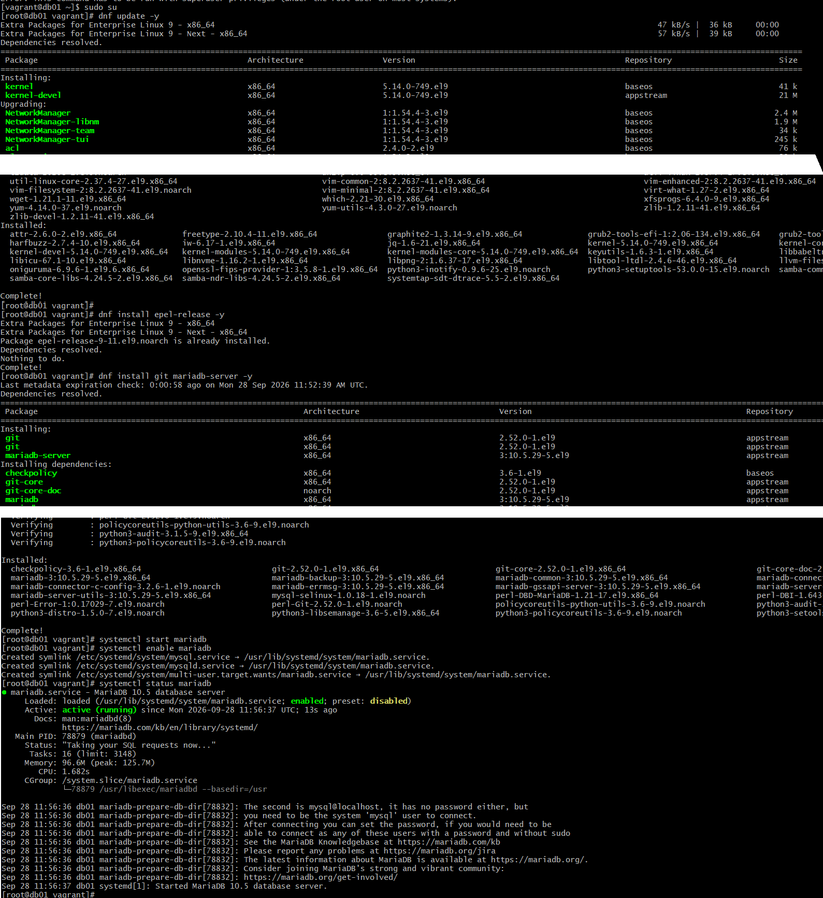
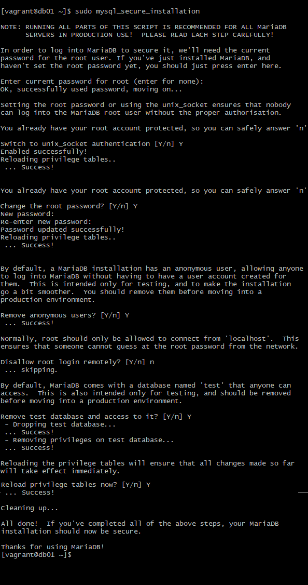
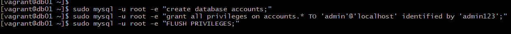
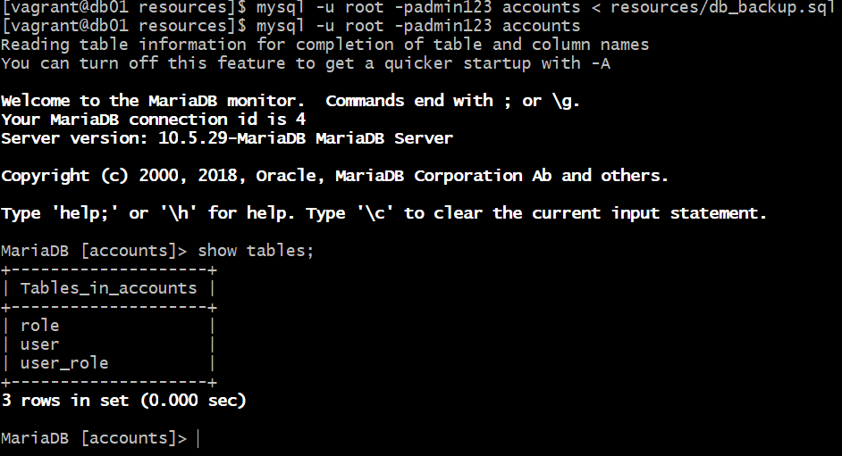
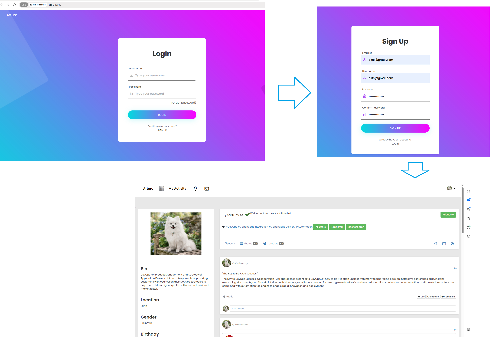
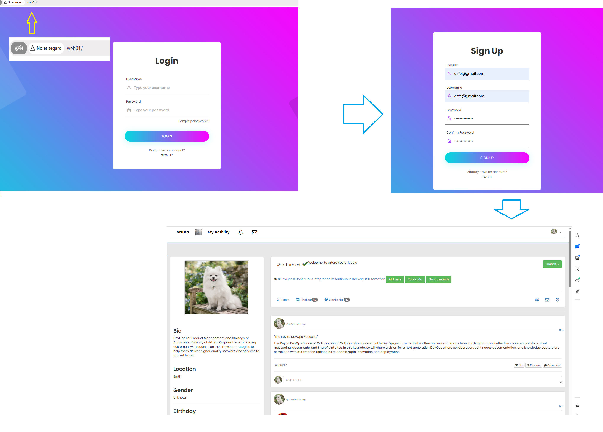

# Manual deployment of the project locally using Vagrant

This section provides a step-by-step guide to manually deploy the project locally using Vagrant. By following these instructions, you will be able to set up a local development environment that mirrors the production environment, allowing for efficient testing and development.

To facilitate it we have provided a Vagrantfile that defines the baseline configuration of the virtual machine, including the operating system, network settings, and shared folders.

Additionally, we have included provisioning command lines to be executed by you, the curious user, during the provisioning process that automate the installation of necessary software and dependencies.

## Pre-requisites

- Oracle VirtualBox
- Git bash or equivalent terminal
- Vagrant
- Vagrant plugins: 
  - vagrant-vbguest:
    - vagrant-vbguest is a Vagrant plugin that automatically installs the host's VirtualBox Guest Additions on the guest system.
    - This ensures that the guest system has the necessary drivers and tools to work seamlessly with the host system, improving performance and enabling features like shared folders and clipboard sharing.
  - vagrant-hostmanager:
    - It automatically updates the /etc/hosts file with the hostnames and IP addresses of all the virtual machines that are brought up with Vagrant.
    - It allows both the virtual machines and your computer to communicate with each other using easy-to-remember names (for example, db01, app01, web01), instead of having to use IP addresses.

## Steps to manually deploy the project locally using Vagrant

1. Clone the repository to your local machine using Git bash or equivalent terminal:
   ```bash
   git clone https://github.com/A00AB772/devops-exercise-from-local-to-cloud
   ```
   
2. Navigate to the project directory:
   ```bash
   cd devops-exercise-from-local-to-cloud/vagrant/Manual_provisioning
   ```
   
You can see there the [Manually Provisioned Vagrantfile](vagrant/Manual_provisioning/Vagrantfile) file, which defines the default configuration of the virtual machines over which we will be running the installation scripts after they are successfully spinned up.

3. Start the Vagrant environment:
   ```bash
   vagrant up
   
You may expect an output like this:



   
4. Now you can SSH into the Vagrant machine:

But remember, you need to specify the VM name to target in a multi-VM environment. For example, if you want to SSH into the db01 VM, you would use the following command:

   ```bash
   vagrant ssh db01
   [vagrant@db01 ~]$ hostname
    db01
    [vagrant@db01 ~]$ ps -ef
    UID          PID    PPID  C STIME TTY          TIME CMD
    root           1       0  0 09:42 ?        00:00:10 /usr/lib/systemd/systemd text --switched-root --system --deserialize 31
    root           2       0  0 09:42 ?        00:00:00 [kthreadd]
    root           3       2  0 09:42 ?        00:00:00 [rcu_gp]
    root           4       2  0 09:42 ?        00:00:00 [rcu_par_gp]
    root           5       2  0 09:42 ?        00:00:00 [slub_flushwq]
    root           6       2  0 09:42 ?        00:00:00 [netns]
    root           8       2  0 09:42 ?        00:00:00 [kworker/0:0H-events_highpri]
    ...
   ```

Otherwise, you will have this an error like this:

   ```bash
   devops-exercise-from-local-to-cloud\vagrant\Manual_provisioning> vagrant ssh
    
   This command requires a specific VM name to target in a multi-VM environment.
   ```

Here we can see what is the effect of vagrant-hostmanager plugin:



Each VM has a reference to the other VMs in the /etc/hosts file, allowing them to communicate with each other using their hostnames.

Next, we will be running the provisioning commands to set up the environment. Please follow the instructions in the next sections to complete the setup.


## MySQL Database Setup


After logging into the db01 VM, we will proceed with the MySQL database setup. First, we will change to the root user:

```bash
sudo su -
```

Next, we will update OS with latest patches

```bash
dnf update -y
```

Next, we will set the repository

```bash
dnf install epel-release -y
```

Next, we will install Maria DB Package

```bash
dnf install git mariadb-server -y
```

Next, we will start and enable the MariaDB service to ensure it runs on boot:

```bash
systemctl start mariadb
systemctl enable mariadb
```
Now the database service is up and running.



Next step is to secure the MySQL installation. This involves setting a root password, removing anonymous users, disallowing remote root login, and removing the test database:

```bash
sudo mysql_secure_installation
```




Next, we will log in to the MySQL shell using the root user and the password we just set and will run the configuration commands to create a new database and user for our application:



```bash 
mysql -u root -padmin123
sudo mysql -u root -e "create database accounts;"
sudo mysql -u root -e "grant all privileges on accounts.* TO 'admin'@'localhost' identified by 'admin123';"
sudo mysql -u root -e "FLUSH PRIVILEGES;"
```

Next, we will initialize the database, for wich you first need to copy the resources/db_backup.sql file to the db01 VM.

You can use the following command to copy the file from your local machine to the VM:

```bash
vagrant scp ../../src/main/resources/db_backup.sql db01:/home/vagrant/
```


```bash
sudo mysql -u root -e "source resources/db_backup.sql;"
sudo mysql -u root -e "show tables;"
```




Restart mariadb-server

```bash
systemctl restart mariadb
```

Start the firewall and allow the mariadb to access from port 3306

```bash
sudo systemctl start firewalld
sudo systemctl enable firewalld
sudo firewall-cmd --get-active-zones
sudo firewall-cmd --zone=public --add-port=3306/tcp --permanent
sudo firewall-cmd --reload
sudo systemctl restart mariadb
```

## Memcached Setup

For simplicity, we will just see the commands that you need to run to set up Memcached on the app01 VM without a detailed screenshot explanation:

```bash
user@DESKTOP-SCNMK3I MINGW64 ~/Documents/devops-exercise-from-local-to-cloud/vagrant/Manual_provisioning
$ vagrant ssh mc01
[vagrant@mc01 ~]$

[vagrant@mc01 ~]$ sudo dnf update -y
CentOS Stream 9 - BaseOS                                                                                                                    2.9 MB/s | 8.9 MB     00:03
...

[vagrant@mc01 ~]$ sudo dnf install epel-release -y
...

[vagrant@rmq01 ~]$ sudo dnf install -y nmap-ncat

[vagrant@mc01 ~]$ sudo dnf install memcached -y
...

[vagrant@mc01 ~]$ sudo sed -i 's/127.0.0.1/0.0.0.0/g' /etc/sysconfig/memcached

[vagrant@mc01 ~]$ sudo sed -i 's/OPTIONS="-l 0.0.0.0,::1"/OPTIONS="-l 0.0.0.0"/g' /etc/sysconfig/memcached


[vagrant@mc01 ~]$ sudo systemctl start memcached

[vagrant@mc01 ~]$ sudo systemctl enable memcached

[vagrant@mc01 ~]$ sudo systemctl status memcached

[vagrant@mc01 ~]$ sudo systemctl start firewalld
[vagrant@mc01 ~]$ sudo systemctl enable firewalld
[vagrant@mc01 ~]$ sudo firewall-cmd --add-port=11211/tcp
[vagrant@mc01 ~]$ sudo firewall-cmd --permanent --add-port=11211/tcp
[vagrant@mc01 ~]$ sudo firewall-cmd --permanent --add-port=11111/tcp
[vagrant@mc01 ~]$ sudo memcached -p 11211 -U 11111 -u memcached -d
```

## RabbitMQ Setup


For simplicity, we will just see the commands that you need to run to set up RabbitMQ on the app01 VM without a detailed screenshot explanation:

```bash
user@DESKTOP-SCNMK3I MINGW64 ~/Documents/devops-exercise-from-local-to-cloud/vagrant/Manual_provisioning
$ vagrant ssh rmq01

[vagrant@rmq01 ~]$ sudo dnf update -y

[vagrant@rmq01 ~]$ sudo dnf install epel-release -y

[vagrant@rmq01 ~]$ sudo dnf install wget -y

[vagrant@rmq01 ~]$ sudo dnf install -y nmap-ncat

[vagrant@rmq01 ~]$ sudo dnf -y install centos-release-rabbitmq-38

[vagrant@rmq01 ~]$ sudo dnf --enablerepo=centos-rabbitmq-38 -y install rabbitmq-server

[vagrant@rmq01 ~]$ sudo systemctl enable --now rabbitmq-server

[vagrant@rmq01 ~]$ sudo sh -c 'echo "[{rabbit, [{loopback_users, []}]}]." > /etc/rabbitmq/rabbitmq.config'

[vagrant@rmq01 ~]$ sudo rabbitmqctl add_user test test

[vagrant@rmq01 ~]$ sudo rabbitmqctl set_user_tags test administrator

[vagrant@rmq01 ~]$ sudo rabbitmqctl set_permissions -p / test ".*" ".*" ".*"

[vagrant@rmq01 ~]$ sudo systemctl start firewalld

[vagrant@rmq01 ~]$ sudo systemctl enable firewalld

[vagrant@rmq01 ~]$ sudo firewall-cmd --add-port=5672/tcp

[vagrant@rmq01 ~]$ sudo firewall-cmd --permanent --add-port=5672/tcp

[vagrant@rmq01 ~]$ sudo systemctl start rabbitmq-server

[vagrant@rmq01 ~]$ sudo systemctl enable rabbitmq-server

[vagrant@rmq01 ~]$ sudo systemctl status rabbitmq-server
```

## Tomcat Setup

Idem

```bash
user@DESKTOP-SCNMK3I MINGW64 ~/Documents/devops-exercise-from-local-to-cloud/vagrant/Manual_provisioning
$ vagrant ssh app01

[vagrant@app01 ~]$ sudo dnf update -y

[vagrant@app01 ~]$ sudo dnf -y install java-17-openjdk java-17-openjdk-devel

[vagrant@app01 ~]$ sudo dnf install git wget -y

[vagrant@app01 ~]$ cd /tmp/

[vagrant@app01 ~]$ wget https://archive.apache.org/dist/tomcat/tomcat-10/v10.1.26/bin/apache-tomcat-10.1.26.tar.gz

[vagrant@app01 ~]$ tar xzvf apache-tomcat-10.1.26.tar.gz

[vagrant@app01 ~]$ sudo useradd --home-dir /usr/local/tomcat --shell /sbin/nologin tomcat

[vagrant@app01 ~]$ sudo cp -r /tmp/apache-tomcat-10.1.26/* /usr/local/tomcat/

[vagrant@app01 ~]$ sudo chown -R tomcat.tomcat /usr/local/tomcat

[vagrant@app01 ~]$ sudo tee /etc/systemd/system/tomcat.service << 'EOF'
[Unit]
Description=Tomcat
After=network.target
[Service]
User=tomcat
Group=tomcat
WorkingDirectory=/usr/local/tomcat
Environment=JAVA_HOME=/usr/lib/jvm/jre
Environment=CATALINA_PID=/var/tomcat/%i/run/tomcat.pid
Environment=CATALINA_HOME=/usr/local/tomcat
Environment=CATALINE_BASE=/usr/local/tomcat
ExecStart=/usr/local/tomcat/bin/catalina.sh run
ExecStop=/usr/local/tomcat/bin/shutdown.sh
RestartSec=10
Restart=always
[Install]
WantedBy=multi-user.target
EOF

[vagrant@app01 ~]$ sudo systemctl daemon-reload

[vagrant@app01 ~]$ sudo systemctl start tomcat

[vagrant@app01 ~]$ sudo systemctl enable tomcat

[vagrant@app01 ~]$ sudo systemctl status tomcat


vi /usr/local/tomcat/conf/tomcat-users.xml

[vagrant@app01 ~]$ sudo sed -i '/<\/tomcat-users>/i \
<role rolename="manager-gui"/>\
<role rolename="manager-status"/>\
<role rolename="manager-script"/>\
<role rolename="manager-jmx"/>\
<user username="tomcat" password="s3cret" roles="manager-gui,manager-status,manager-script,manager-jmx"/>' /usr/local/tomcat/conf/tomcat-users.xml

[vagrant@app01 ~]$ sudo tee -a /usr/local/tomcat/conf/tomcat-users.xml << 'EOF'
<role rolename="manager-gui"/>
<user username="tomcat" password="s3cret" roles="manager-gui"/>
EOF

[vagrant@app01 ~]$ sudo sed -i '/RemoteAddrValve/s/^/<!-- /; /RemoteAddrValve/s/$/ -->/' /usr/local/tomcat/webapps/manager/META-INF/context.xml

[vagrant@app01 ~]$ sudo sed -i '/RemoteAddrValve/s/^/<!-- /; /RemoteAddrValve/s/$/ -->/' /usr/local/tomcat/webapps/host-manager/META-INF/context.xml

[vagrant@app01 ~]$ sudo sed -i 's|pathname="conf/tomcat-users.xml"|pathname="/usr/local/tomcat/conf/tomcat-users.xml"|g' /usr/local/tomcat/conf/server.xml

[vagrant@app01 ~]$ sudo systemctl start firewalld

[vagrant@app01 ~]$ sudo systemctl enable firewalld

[vagrant@app01 ~]$ sudo firewall-cmd --get-active-zones

[vagrant@app01 ~]$ sudo firewall-cmd --zone=public --add-port=8080/tcp --permanent

[vagrant@app01 ~]$ sudo firewall-cmd --reload
```

## Deploy the application in the Tomcat server

Straight to the commands:

```bash

user@DESKTOP-SCNMK3I MINGW64 ~/Documents/devops-exercise-from-local-to-cloud/vagrant/Manual_provisioning
$ vagrant scp ../../../devops-exercise-from-local-to-cloud/ app01:/tmp/


user@DESKTOP-SCNMK3I MINGW64 ~/Documents/devops-exercise-from-local-to-cloud/vagrant/Manual_provisioning
$ vagrant ssh app01

[vagrant@app01 ~]$ cd /tmp/

[vagrant@app01 ~]$ wget https://archive.apache.org/dist/maven/maven-3/3.9.9/binaries/apache-maven-3.9.9-bin.zip

[vagrant@app01 ~]$ unzip apache-maven-3.9.9-bin.zip

[vagrant@app01 ~]$ sudo cp -r apache-maven-3.9.9 /usr/local/maven3.9

[vagrant@app01 ~]$ cd /tmp/devops-exercise-from-local-to-cloud/

[vagrant@app01 ~]$ export MAVEN_OPTS="-Xmx512m -XX:MaxMetaspaceSize=256m" && /usr/local/maven3.9/bin/mvn install

[vagrant@app01 ~]$ sudo systemctl stop tomcat

[vagrant@app01 ~]$ sudo rm -rf /usr/local/tomcat/webapps/ROOT*

[vagrant@app01 ~]$ sudo cp target/devops-exercise-from-local-to-cloud-v2.war /usr/local/tomcat/webapps/ROOT.war

[vagrant@app01 ~]$ sudo chown tomcat.tomcat /usr/local/tomcat/webapps -R

[vagrant@app01 ~]$ sudo systemctl start tomcat
```

At this point in time, the application is deployed in the Tomcat server and can be accessed via the browser at http://app01:8080 or http://<your-vm-ip>:8080.



## Nginx Setup

Idem

```bash
user@DESKTOP-SCNMK3I MINGW64 ~/Documents/devops-exercise-from-local-to-cloud/vagrant/Manual_provisioning
$ vagrant ssh web01

vagrant@web01:~$ sudo su

root@web01:/home/vagrant# apt update && apt upgrade

root@web01:/home/vagrant# apt install nginx -y

root@web01:/home/vagrant# sudo tee /etc/nginx/sites-available/vproapp << 'EOF'
upstream vproapp {
  server app01:8080;
}

server {
  listen 80;
  location / {
    proxy_pass http://vproapp;
  }
}
EOF

root@web01:/home/vagrant# rm -rf /etc/nginx/sites-enabled/default

root@web01:/home/vagrant# ln -s /etc/nginx/sites-available/vproapp /etc/nginx/sites-enabled/

root@web01:/home/vagrant# ln -s /etc/nginx/sites-available/vproapp /etc/nginx/sites-enabled/vproapp

root@web01:/home/vagrant# systemctl restart nginx
```

At this point in time, the application is accessible via the browser at http://web01 or http://<your-vm-ip>.




After you test it you can destroy the Vagrant environment to free up system resources:

```bash
root@web01:/home/vagrant# exit
exit
vagrant@web01:~$ exit
logout

user@DESKTOP-SCNMK3I MINGW64 ~/Documents/devops-exercise-from-local-to-cloud/vagrant/Manual_provisioning
$ vagrant destroy -f
==> web01: Forcing shutdown of VM...
Connection to 127.0.0.1 closed by remote host.
tcsetattr: Input/output error
==> web01: Destroying VM and associated drives...
==> web01: [vagrant-hostmanager:guests] Updating hosts file on active guest virtual machines...
==> web01: [vagrant-hostmanager:host] Updating hosts file on your workstation (password may be required)...
==> app01: Forcing shutdown of VM...
Connection to 127.0.0.1 closed by remote host.
Connection to 127.0.0.1 closed by remote host.
tcsetattr: Input/output error
tcsetattr: Input/output error
Connection to 127.0.0.1 closed by remote host.
Connection to 127.0.0.1 closed by remote host.
Connection to 127.0.0.1 closed by remote host.
tcsetattr: Input/output error
tcsetattr: Input/output error
tcsetattr: Input/output error
Connection to 127.0.0.1 closed by remote host.
Connection to 127.0.0.1 closed by remote host.
Connection to 127.0.0.1 closed by remote host.
tcsetattr: Input/output error
Connection to 127.0.0.1 closed by remote host.
Connection to 127.0.0.1 closed by remote host.
Connection to 127.0.0.1 closed by remote host.
tcsetattrConnection to 127.0.0.1 closed by remote host.
tcsetattr: : Input/output errorInput/output error

tcsetattr: Input/output error
tcsetattr: Input/output error
tcsetattrtcsetattr: : Input/output errorInput/output error

user@DESKTOP-SCNMK3I MINGW64 ~/Documents/devops-exercise-from-local-to-cloud/vagrant/Manual_provisioning
$ vagrant global-status
id       name   provider   state   directory
--------------------------------------------------------------------------------------------------------------------------------------------------------------------------------------------
fed9d25  db01   virtualbox running C:/Users/user/Documents/devops-exercise-from-local-to-cloud/vagrant/Manual_provisioning
8fa8779  mc01   virtualbox running C:/Users/user/Documents/devops-exercise-from-local-to-cloud/vagrant/Manual_provisioning
502fc1f  rmq01  virtualbox running C:/Users/user/Documents/devops-exercise-from-local-to-cloud/vagrant/Manual_provisioning
6f7fb27  app01  virtualbox running C:/Users/user/Documents/devops-exercise-from-local-to-cloud/vagrant/Manual_provisioning

The above shows information about all known Vagrant environments
on this machine. This data is cached and may not be completely
up-to-date (use "vagrant global-status --prune" to prune invalid
entries). To interact with any of the machines, you can go to that
directory and run Vagrant, or you can use the ID directly with
Vagrant commands from any directory. For example:
"vagrant destroy 1a2b3c4d"

user@DESKTOP-SCNMK3I MINGW64 ~/Documents/devops-exercise-from-local-to-cloud/vagrant/Manual_provisioning
$ vagrant destroy fed9d25
    db01: Are you sure you want to destroy the 'db01' VM? [y/N] y
==> db01: Forcing shutdown of VM...
==> db01: Destroying VM and associated drives...
==> db01: [vagrant-hostmanager:guests] Updating hosts file on active guest virtual machines...
==> db01: [vagrant-hostmanager:host] Updating hosts file on your workstation (password may be required)...

user@DESKTOP-SCNMK3I MINGW64 ~/Documents/devops-exercise-from-local-to-cloud/vagrant/Manual_provisioning
$ vagrant destroy -f 8fa8779
==> mc01: Forcing shutdown of VM...
==> mc01: Destroying VM and associated drives...
==> mc01: [vagrant-hostmanager:guests] Updating hosts file on active guest virtual machines...
==> mc01: [vagrant-hostmanager:host] Updating hosts file on your workstation (password may be required)...

user@DESKTOP-SCNMK3I MINGW64 ~/Documents/devops-exercise-from-local-to-cloud/vagrant/Manual_provisioning
$ vagrant destroy 502fc1f -f
==> rmq01: Forcing shutdown of VM...
==> rmq01: Destroying VM and associated drives...
==> rmq01: [vagrant-hostmanager:guests] Updating hosts file on active guest virtual machines...
==> rmq01: [vagrant-hostmanager:host] Updating hosts file on your workstation (password may be required)...

user@DESKTOP-SCNMK3I MINGW64 ~/Documents/devops-exercise-from-local-to-cloud/vagrant/Manual_provisioning
$ vagrant destroy -f 6f7fb27
==> app01: Destroying VM and associated drives...
==> app01: [vagrant-hostmanager:guests] Updating hosts file on active guest virtual machines...
==> app01: [vagrant-hostmanager:host] Updating hosts file on your workstation (password may be required)...

user@DESKTOP-SCNMK3I MINGW64 ~/Documents/devops-exercise-from-local-to-cloud/vagrant/Manual_provisioning
$ vagrant global-status
id       name   provider state  directory
--------------------------------------------------------------------
There are no active Vagrant environments on this computer! Or,
you haven't destroyed and recreated Vagrant environments that were
started with an older version of Vagrant.
```

## Conclusion

Overall experience is that, the manual provisioning of the project has been tedious and time-consuming, but it has provided a deeper understanding of the underlying technologies and configurations involved in setting up a local development environment.

This is the ground for next step, which is to automate the provisioning process, which will save time and reduce the risk of human error. By automating the provisioning process, we can ensure that the environment is set up consistently and reliably, allowing for more efficient testing and development.

Next you can explore the [Automated Provisioning](../Automated_provisioning/README.md) section, which will guide you through the process of automating the provisioning of the project using Vagrant.